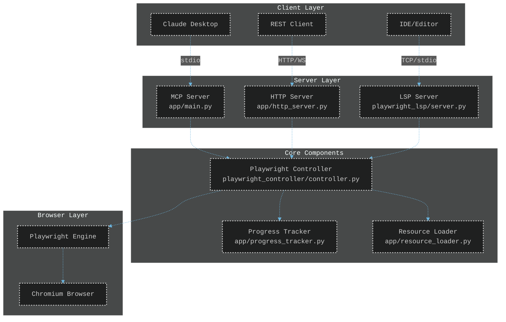

# TINAA - Testing Intelligence Network Automation Assistant

A Model Context Protocol (MCP) server for Playwright automation with integrated Language Server Protocol (LSP) for intelligent test automation assistance.

## Quick Start with Pre-built Docker Image

```bash
# Pull the latest pre-built image from GitHub Container Registry
docker pull ghcr.io/aj-geddes/tinaa-playwright-msp:latest

# Run with docker-compose (recommended)
wget https://raw.githubusercontent.com/aj-geddes/tinaa-playwright-msp/main/docker-compose.prod.yml
docker-compose -f docker-compose.prod.yml up -d

# Or run directly
docker run -d -p 8765:8765 ghcr.io/aj-geddes/tinaa-playwright-msp:latest
```

## Architecture Overview



## Features

### Core Capabilities
- **Full Playwright Automation**: Complete browser control through MCP protocol (`app/main.py`)
- **Multi-Mode Operation**:
  - MCP mode (stdio) for Claude integration
  - HTTP mode with WebSocket support for IDE integration (`app/http_server.py`)
- **Real-Time Progress Tracking**: Live updates during test execution (`app/progress_tracker.py`)
- **Language Server Protocol**: Code assistance for Playwright scripts (`playwright_lsp/server.py`)

### Testing Capabilities
- **Exploratory Testing**: AI-powered test generation with heuristics (`resources/exploratory_heuristics.json`)
- **Accessibility Testing**: WCAG 2.1 compliance validation (`resources/accessibility_rules.json`)
- **Responsive Design Testing**: Multi-viewport layout verification
- **Security Testing**: Basic vulnerability scanning (`resources/security_test_patterns.json`)
- **Form Analysis**: Automatic form field detection and validation

### Extended Resources Framework
TINAA includes a comprehensive resource framework following the gofastmcp.com v2.8.0 specification with **25 specialized resources**:

#### 🛠️ **Tools** (9 resources)
- **CLI Tools**: Playwright installation, advanced test runner
- **Project Scaffolding**: Page Object Model generator, project initialization
- **CI/CD Integration**: Setup configurations for major platforms
- **Visual Testing**: Percy integration, screenshot comparison
- **Debugging**: Trace viewer utilities
- **State Management**: Authentication and storage state handling

#### 🚀 **Quickstarts** (4 resources)
- **Web Testing**: Basic web application testing guides
- **Mobile Testing**: Device emulation and responsive testing
- **API Testing**: REST and GraphQL endpoint testing
- **Hybrid Testing**: Combined UI and API testing approaches

#### 📘 **Examples** (4 resources)
- **Login Flows**: Authentication patterns and test cases
- **CRUD Forms**: Create, Read, Update, Delete operation testing
- **Shopping Cart**: E-commerce checkout flow automation
- **Analytics Dashboard**: Data visualization and dashboard testing

#### 📚 **Documentation** (3 resources)
- **Best Practices**: Recommended patterns and approaches
- **Troubleshooting**: Common issues and solutions guide
- **Design Patterns**: Architectural patterns for test automation

#### 🤖 **AI Prompts** (3 resources)
- **Test Generator**: Generate tests from requirements specifications
- **Code Reviewer**: Automated code quality analysis and suggestions
- **Debug Assistant**: Intelligent troubleshooting and error resolution

#### 📊 **Additional Resources** (2 resources)
- **Resource Index**: Central registry of all available resources
- **Testing Strategies**: Comprehensive testing methodology guidelines

## Installation

### Option 1: Use Pre-built Docker Image (Fastest)

```bash
# Download production docker-compose file
wget https://raw.githubusercontent.com/aj-geddes/tinaa-playwright-msp/main/docker-compose.prod.yml

# Start the service
docker-compose -f docker-compose.prod.yml up -d

# Verify it's running
curl http://localhost:8765/health
```

### Option 2: Build from Source with Docker

1. Clone the repository:
   ```bash
   git clone https://github.com/aj-geddes/tinaa-playwright-msp.git
   cd tinaa-playwright-msp
   ```

2. Build and run in MCP mode:
   ```bash
   docker-compose up -d
   ```

3. Or run in HTTP mode:
   ```bash
   docker-compose -f docker-compose.http.yml up -d
   ```

### Option 3: Manual Installation

Install dependencies from `requirements.txt`:
```bash
pip install -r requirements.txt
```

Required dependencies:
- `fastmcp==2.8.0`
- `playwright==1.46.0`
- `fastapi>=0.104.0`
- `pygls>=1.0.0`
- `pydantic>=2.0.0`

## Configuration

### Environment Variables

The following environment variables are used (defined in `docker-compose.yml`):
- `PYTHONUNBUFFERED=1` - Ensures immediate output
- `PLAYWRIGHT_BROWSERS_PATH=/ms-playwright` - Browser installation path
- `TINAA_MODE` - Switches between 'mcp' and 'http' modes

### Docker Configuration

**Ports**:
- `8765` - Used for both MCP stdio server and HTTP API

**Volumes**:
- `./logs:/app/logs` - Log file persistence
- `${PWD}:/mnt/workspace` - Workspace mounting for file access

## API Reference

### MCP Tools

Available tools via MCP protocol (defined in `app/main.py`):

| Tool | Description | Parameters |
|------|-------------|------------|
| `start_lsp_server` | Launch LSP server | `tcp: bool, port: int` |
| `test_browser_connectivity` | Verify browser setup | None |
| `navigate_to_url` | Navigate browser to URL | `url: str` |
| `take_page_screenshot` | Capture screenshot | `name: str` |
| `fill_login_form` | Test authentication forms | `username: str, password: str, selectors: dict` |
| `run_exploratory_test` | Execute exploratory test | `url: str, max_depth: int` |
| `run_accessibility_test` | Run WCAG compliance test | `url: str, standard: str` |
| `run_responsive_test` | Test responsive design | `url: str, viewports: list` |
| `run_security_test` | Basic security scan | `url: str` |

### HTTP Endpoints

Available endpoints via HTTP API (defined in `app/http_server.py`):

| Method | Endpoint | Description |
|--------|----------|-------------|
| GET | `/` | Root endpoint |
| GET | `/health` | Health check |
| POST | `/test/connectivity` | Test browser connectivity |
| POST | `/navigate` | Navigate to URL |
| POST | `/screenshot` | Take screenshot |
| POST | `/test/exploratory` | Run exploratory test (streaming) |
| POST | `/test/accessibility` | Run accessibility test (streaming) |
| POST | `/playbook/execute` | Execute test playbook |
| WS | `/ws/{client_id}` | WebSocket connection |

## Usage Examples

### Via Claude Desktop

Configure in Claude Desktop settings:
```json
{
  "mcpServers": {
    "tinaa-playwright-msp": {
      "command": "docker",
      "args": ["run", "--rm", "-i", "tinaa-playwright-msp:latest"]
    }
  }
}
```

### Via HTTP API

```python
import requests

# Test connectivity
response = requests.post("http://localhost:8765/test/connectivity")

# Navigate to URL
response = requests.post("http://localhost:8765/navigate",
    json={"url": "https://example.com"})

# Run accessibility test
response = requests.post("http://localhost:8765/test/accessibility",
    json={"url": "https://example.com", "standard": "WCAG2.1-AA"})

# Execute a test playbook
playbook = {
    "name": "Login and Screenshot Test",
    "steps": [
        {
            "id": "nav",
            "action": "navigate",
            "parameters": {"url": "https://example.com"}
        },
        {
            "id": "shot",
            "action": "screenshot",
            "parameters": {"full_page": True}
        }
    ]
}
response = requests.post("http://localhost:8765/playbook/execute",
    json=playbook)
```

## Using Resources

Access the comprehensive resource library:

```python
# All resources are available at /resources/
# Browse the resource index: /resources/index.json
# Example quickstart: /resources/quickstarts/web/basic.json
# AI prompts: /resources/prompts/test-generator.json

# Resources include:
# - Scaffolding tools for new projects
# - CI/CD integration templates
# - Visual testing configurations
# - Debugging utilities
# - Test patterns and examples
```

## Development

### Project Structure

```javascript
tinaa-playwright-msp/
├── app/                      # Main application code
│   ├── main.py              # MCP server entry point
│   ├── http_server.py       # HTTP/WebSocket server
│   ├── progress_tracker.py  # Progress tracking system
│   └── enhanced_mcp_handler.py # Enhanced MCP handlers
├── playwright_controller/    # Browser automation
│   └── controller.py        # Playwright wrapper
├── playwright_lsp/          # Language server
│   ├── server.py           # LSP server implementation
│   └── handlers/           # LSP request handlers
├── resources/              # Comprehensive resource framework (25 resources)
│   ├── index.json          # Resource registry
│   ├── tools/              # CLI tools, scaffolding, CI/CD setup
│   ├── quickstarts/        # Getting started guides
│   ├── examples/           # Real-world test examples
│   ├── docs/               # Best practices and troubleshooting
│   ├── prompts/            # AI-powered prompts for testing
│   └── templates/          # Reusable templates
├── tools/                  # Modular testing tools
├── tests/                  # Test suite
│   ├── unit/              # Unit tests
│   ├── integration/       # Integration tests
│   └── e2e/              # End-to-end tests
└── scripts/               # Build and utility scripts
```

### Running Tests

```bash
# Run all tests
pytest

# Run with coverage
pytest --cov=app --cov=playwright_controller

# Run specific test category
pytest tests/unit/
```

## Contributing

Contributions are welcome! Please feel free to submit issues or pull requests.

## License

This project is licensed under the MIT License - see the [LICENSE](LICENSE) file for details.

## Acknowledgments

Built with FastMCP, Playwright, and FastAPI.