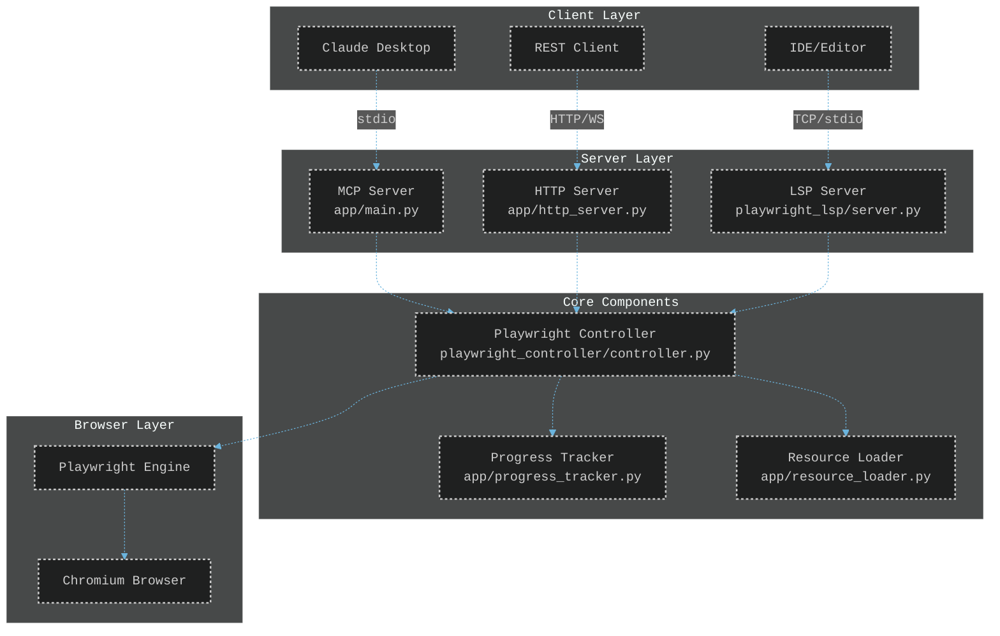

# TINAA - Test Intelligence and Automation Advanced

A Model Context Protocol (MCP) server for Playwright automation with integrated Language Server Protocol (LSP) for intelligent test automation assistance.

## Architecture Overview



## Features

### Core Capabilities
- **Full Playwright Automation**: Complete browser control through MCP protocol (`app/main.py`)
- **Multi-Mode Operation**: 
  - MCP mode (stdio) for Claude integration
  - HTTP mode with WebSocket support for IDE integration (`app/http_server.py`)
- **Real-Time Progress Tracking**: Live updates during test execution (`app/progress_tracker.py`)
- **Language Server Protocol**: Code assistance for Playwright scripts (`playwright_lsp/server.py`)

### Testing Capabilities
- **Exploratory Testing**: AI-powered test generation with heuristics (`resources/exploratory_heuristics.json`)
- **Accessibility Testing**: WCAG 2.1 compliance validation (`resources/accessibility_rules.json`)
- **Responsive Design Testing**: Multi-viewport layout verification
- **Security Testing**: Basic vulnerability scanning (`resources/security_test_patterns.json`)
- **Form Analysis**: Automatic form field detection and validation

## Installation

### Using Docker (Recommended)

1. Clone the repository:
   ```bash
   git clone https://github.com/aj-geddes/tinaa-playwright-msp.git
   cd tinaa-playwright-msp
   ```

2. Build and run in MCP mode:
   ```bash
   docker-compose up -d
   ```

3. Or run in HTTP mode:
   ```bash
   docker-compose -f docker-compose.http.yml up -d
   ```

### Manual Installation

Install dependencies from `requirements.txt`:
```bash
pip install -r requirements.txt
```

Required dependencies:
- `fastmcp==2.8.0`
- `playwright==1.46.0`
- `fastapi>=0.104.0`
- `pygls>=1.0.0`
- `pydantic>=2.0.0`

## Configuration

### Environment Variables

The following environment variables are used (defined in `docker-compose.yml`):
- `PYTHONUNBUFFERED=1` - Ensures immediate output
- `PLAYWRIGHT_BROWSERS_PATH=/ms-playwright` - Browser installation path
- `TINAA_MODE` - Switches between 'mcp' and 'http' modes

### Docker Configuration

**Ports**:
- `8765` - Used for both MCP stdio server and HTTP API

**Volumes**:
- `./logs:/app/logs` - Log file persistence
- `${PWD}:/mnt/workspace` - Workspace mounting for file access

## API Reference

### MCP Tools

Available tools via MCP protocol (defined in `app/main.py`):

| Tool | Description | Parameters |
|------|-------------|------------|
| `start_lsp_server` | Launch LSP server | `tcp: bool, port: int` |
| `test_browser_connectivity` | Verify browser setup | None |
| `navigate_to_url` | Navigate browser to URL | `url: str` |
| `take_page_screenshot` | Capture screenshot | `name: str` |
| `fill_login_form` | Test authentication forms | `username: str, password: str, selectors: dict` |
| `run_exploratory_test` | Execute exploratory test | `url: str, max_depth: int` |
| `run_accessibility_test` | Run WCAG compliance test | `url: str, standard: str` |
| `run_responsive_test` | Test responsive design | `url: str, viewports: list` |
| `run_security_test` | Basic security scan | `url: str` |

### HTTP Endpoints

Available endpoints via HTTP API (defined in `app/http_server.py`):

| Method | Endpoint | Description |
|--------|----------|-------------|
| GET | `/` | Root endpoint |
| GET | `/health` | Health check |
| POST | `/test/connectivity` | Test browser connectivity |
| POST | `/navigate` | Navigate to URL |
| POST | `/screenshot` | Take screenshot |
| POST | `/test/exploratory` | Run exploratory test (streaming) |
| POST | `/test/accessibility` | Run accessibility test (streaming) |
| POST | `/playbook/execute` | Execute test playbook |
| WS | `/ws/{client_id}` | WebSocket connection |

## Usage Examples

### Via Claude Desktop

Configure in Claude Desktop settings:
```json
{
  "mcpServers": {
    "tinaa-playwright-msp": {
      "command": "docker",
      "args": ["run", "--rm", "-i", "tinaa-playwright-msp:latest"]
    }
  }
}
```

### Via HTTP API

```python
import requests

# Test connectivity
response = requests.post("http://localhost:8765/test/connectivity")

# Navigate to URL
response = requests.post("http://localhost:8765/navigate", 
    json={"url": "https://example.com"})

# Run accessibility test
response = requests.post("http://localhost:8765/test/accessibility",
    json={"url": "https://example.com", "standard": "WCAG2.1-AA"})
```

## Development

### Project Structure

```
tinaa-playwright-msp/
├── app/                      # Main application code
│   ├── main.py              # MCP server entry point
│   ├── http_server.py       # HTTP/WebSocket server
│   ├── progress_tracker.py  # Progress tracking system
│   └── resource_loader.py   # Resource management
├── playwright_controller/    # Browser automation
│   └── controller.py        # Playwright wrapper
├── playwright_lsp/          # Language server
│   ├── server.py           # LSP server implementation
│   └── handlers/           # LSP request handlers
├── resources/              # Test patterns and rules
│   ├── accessibility_rules.json
│   ├── exploratory_heuristics.json
│   └── security_test_patterns.json
├── tools/                  # Modular testing tools
├── tests/                  # Test suite
│   ├── unit/              # Unit tests
│   ├── integration/       # Integration tests
│   └── e2e/              # End-to-end tests
└── scripts/               # Build and utility scripts
```

### Running Tests

```bash
# Run all tests
pytest

# Run with coverage
pytest --cov=app --cov=playwright_controller

# Run specific test category
pytest tests/unit/
```

## Contributing

Contributions are welcome! Please feel free to submit issues or pull requests.

## License

This project is licensed under the MIT License - see the [LICENSE](LICENSE) file for details.

## Acknowledgments

Built with FastMCP, Playwright, and FastAPI.