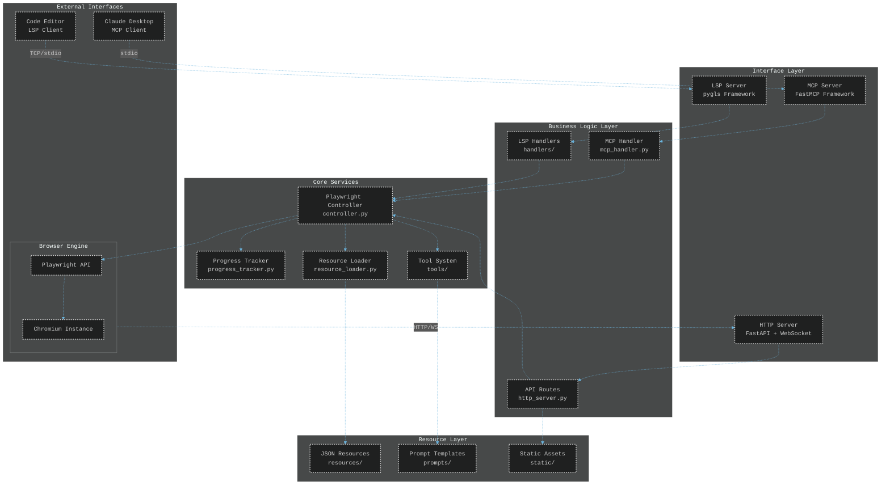
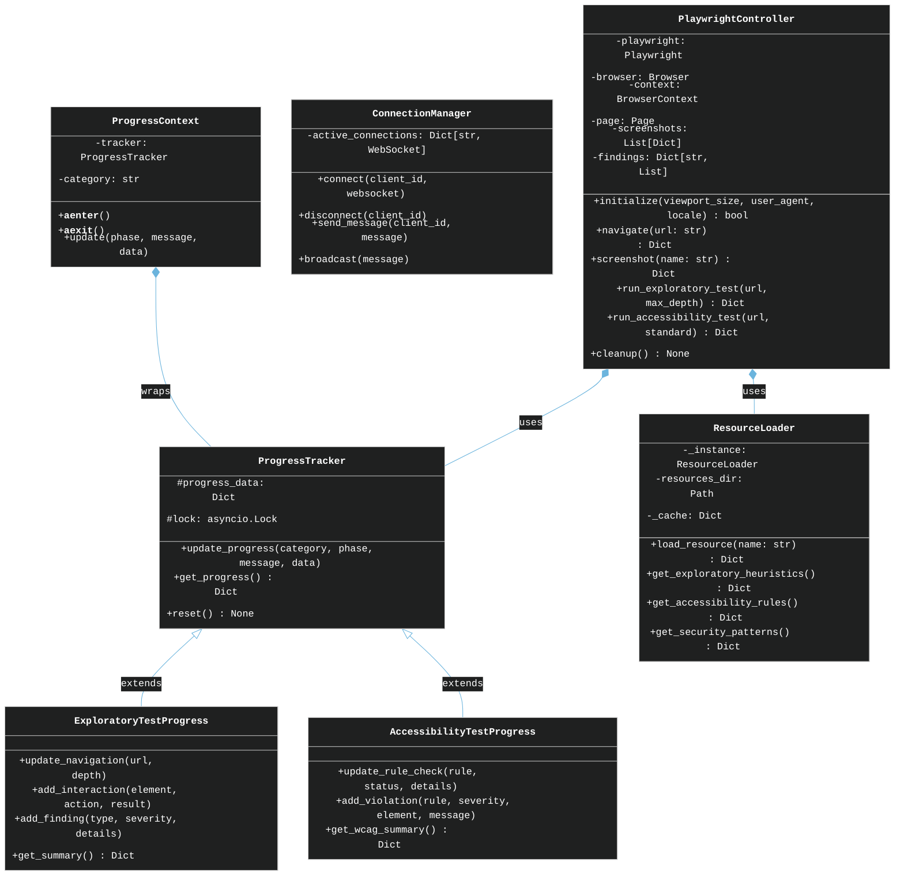
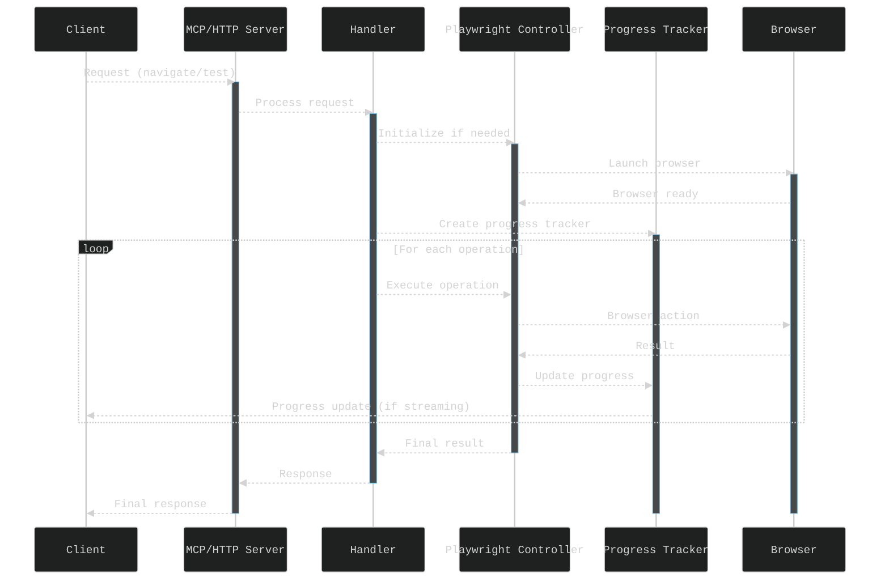
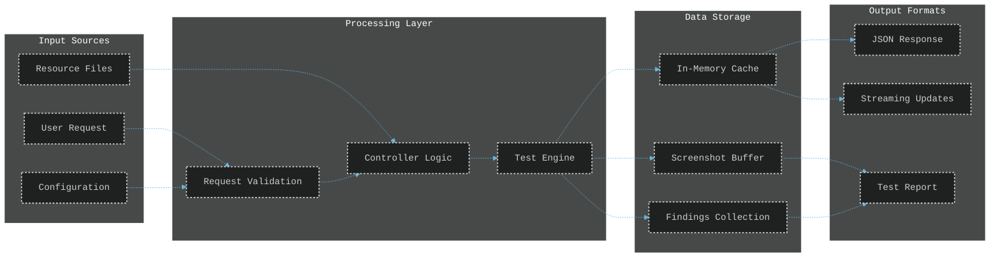
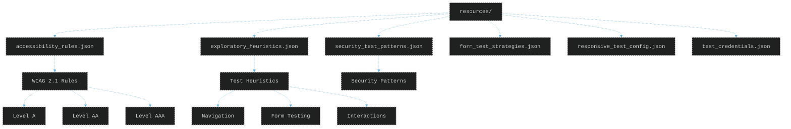
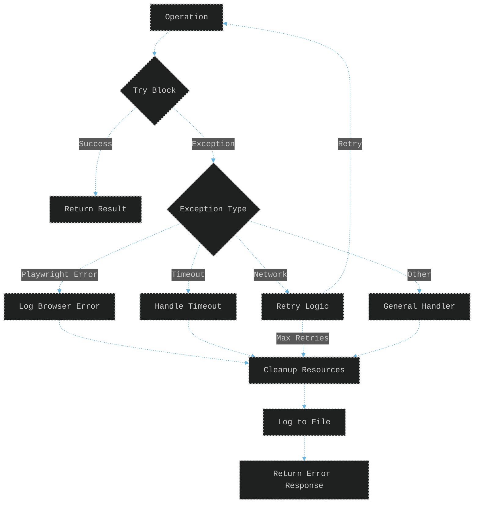
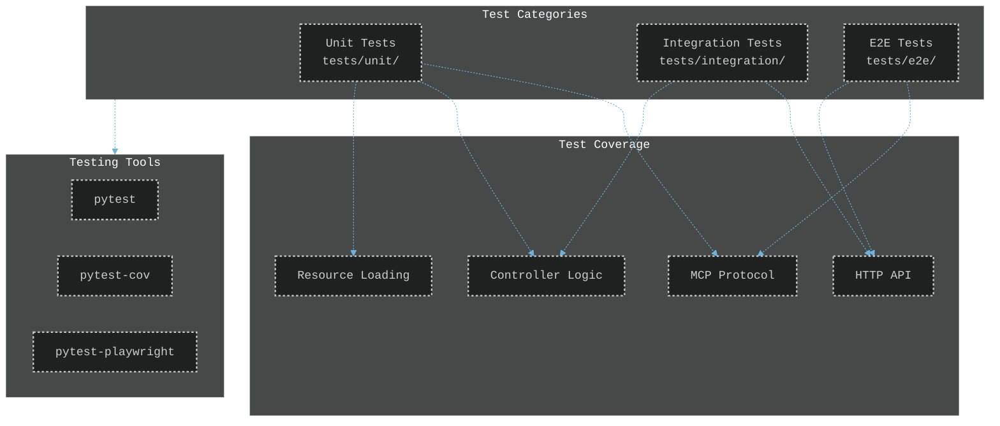

# TINAA Architecture Documentation

## System Components



## Class Architecture



## Request Flow Sequence



## State Management

```mermaid
%%{init: {
  'theme': 'dark',
  'themeVariables': {
    'fontFamily': 'monospace',
    'primaryBorderColor': '#6BB4DD',
    'primaryColor': '#2D3A4D',
    'primaryTextColor': '#fff',
    'lineColor': '#6BB4DD'
  },
  'themeCSS': '.stateText { font-family: monospace; } .statePath { stroke-width: 1.5px; stroke-dasharray: 3,3; }'
}}%%
stateDiagram-v2
    [*] --> Uninitialized
    Uninitialized --> Initializing: initialize()
    Initializing --> Ready: success
    Initializing --> Error: failure
    
    Ready --> Navigating: navigate()
    Navigating --> PageLoaded: success
    Navigating --> Error: failure
    
    PageLoaded --> Testing: run_test()
    Testing --> TestComplete: success
    Testing --> Error: failure
    
    TestComplete --> Ready: reset
    Error --> Ready: retry
    
    Ready --> Cleanup: cleanup()
    PageLoaded --> Cleanup: cleanup()
    TestComplete --> Cleanup: cleanup()
    Cleanup --> [*]
    
    state Testing {
        [*] --> StartPhase
        StartPhase --> InProgress
        InProgress --> CompletePhase
        CompletePhase --> [*]
        
        InProgress --> Warning: non-critical issue
        Warning --> InProgress: continue
        InProgress --> TestError: critical issue
    }
```



## Data Flow



## Resource Structure



## Deployment Architecture

```mermaid
%%{init: {
  'theme': 'dark',
  'themeVariables': {
    'fontFamily': 'monospace',
    'primaryBorderColor': '#6BB4DD',
    'primaryColor': '#2D3A4D',
    'primaryTextColor': '#fff',
    'lineColor': '#6BB4DD'
  },
  'themeCSS': '.node rect, .node circle, .node polygon { stroke-width: 2px; stroke-dasharray: 3,3; }'
}}%%
flowchart TD
    subgraph Host["Host System"]
        Docker[Docker Engine]
        Volumes[Volume Mounts]
    end
    
    subgraph Container["TINAA Container"]
        Base[Base Image<br/>playwright:v1.46.1-jammy]
        Python[Python 3.11]
        App[Application Code]
        Browsers[Chromium Browser]
    end
    
    subgraph Network["Network"]
        Port8765[Port 8765<br/>MCP/HTTP]
        Stdio[STDIO<br/>MCP Mode]
    end
    
    subgraph Storage["Persistent Storage"]
        Logs[logs/]
        Workspace[/mnt/workspace]
    end
    
    Docker -.-> Container
    Container -.-> Network
    Volumes -.-> Storage
    
    App -.-> Python
    Python -.-> Browsers
    Base -.-> Browsers
    
    App -.-> Port8765
    App -.-> Stdio
    
    App -.-> Logs
    App -.-> Workspace
```

## Error Handling Flow



## Testing Strategy



## Key Design Patterns

1. **Singleton Pattern**: ResourceLoader ensures single instance for resource management
2. **Factory Pattern**: Tool loading system dynamically loads testing tools
3. **Context Manager**: ProgressContext provides scoped progress tracking
4. **Observer Pattern**: WebSocket connections for real-time updates
5. **Strategy Pattern**: Different progress trackers for different test types
6. **Adapter Pattern**: MCP/HTTP/LSP servers adapt to common controller interface

## Performance Considerations

- **Async Operations**: All I/O operations use async/await for non-blocking execution
- **Resource Caching**: ResourceLoader caches JSON files to avoid repeated disk reads
- **Connection Pooling**: WebSocket connections managed in ConnectionManager
- **Lazy Initialization**: Browser only launched when needed
- **Streaming Responses**: Large test results streamed rather than buffered

## Security Architecture

- **Headless Execution**: Browser runs in headless mode for security
- **Input Validation**: All inputs validated using Pydantic models
- **Credential Management**: Test credentials stored separately in JSON
- **Non-Invasive Testing**: Security tests designed to be read-only
- **Isolated Execution**: Docker container provides isolation
- **No Persistent State**: Stateless design prevents data leakage between sessions