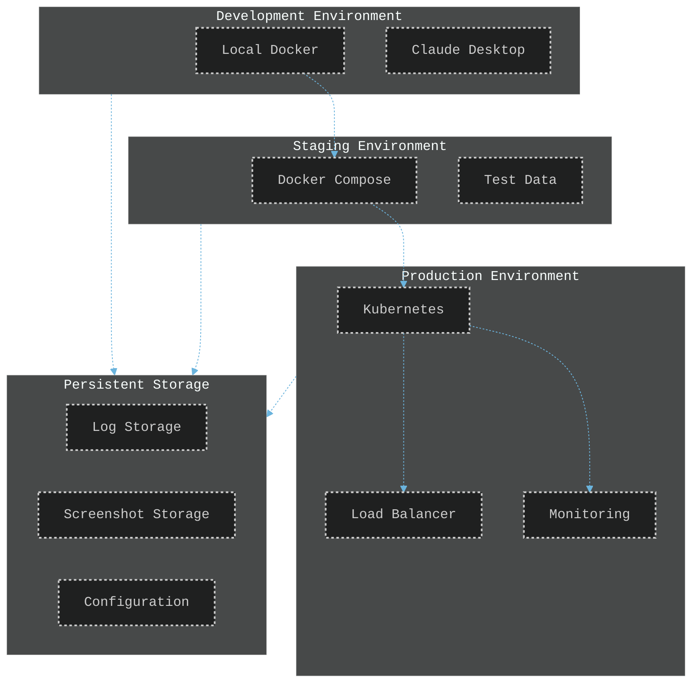
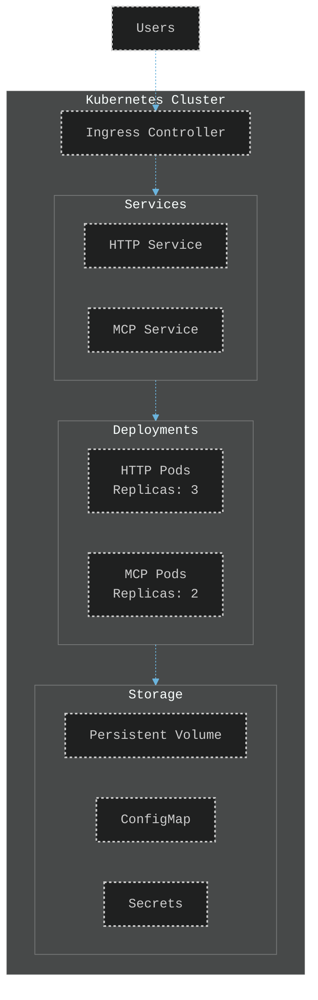
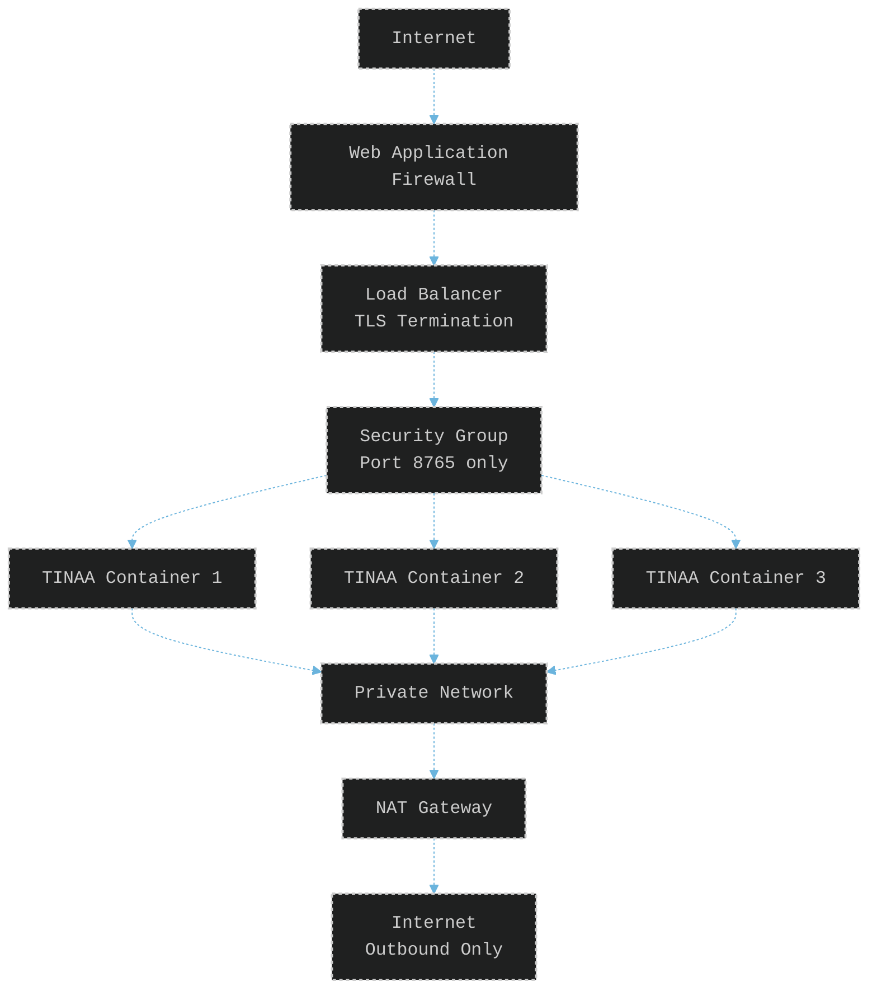
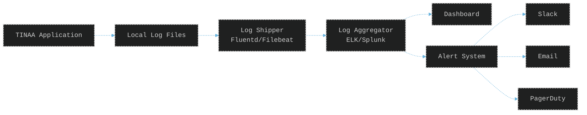
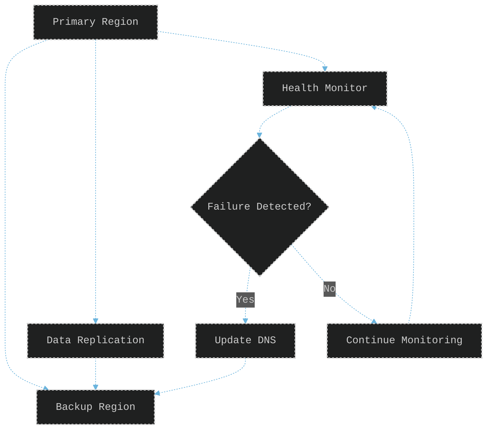

# TINAA Deployment Guide

## Overview

This guide covers deployment options for TINAA in various environments, from local development to production cloud deployments.

## Deployment Architecture



## Local Development

### Using Docker Compose

The simplest deployment method for local development.

**MCP Mode** (for Claude Desktop):
```bash
# Build and run
docker-compose up -d

# View logs
docker-compose logs -f

# Stop
docker-compose down
```

**HTTP Mode** (for API access):
```bash
# Build and run with HTTP server
docker-compose -f docker-compose.http.yml up -d

# Access at http://localhost:8765
```

## Configuration Files

**docker-compose.yml** (MCP mode):
```yaml
version: '3.8'

services:
  tinaa-mcp:
    image: tinaa-playwright-msp:latest
    build:
      context: .
      dockerfile: Dockerfile
    container_name: tinaa-playwright-msp
    environment:
      - PYTHONUNBUFFERED=1
      - PLAYWRIGHT_BROWSERS_PATH=/ms-playwright
    volumes:
      - ./logs:/app/logs
      - ${PWD}:/mnt/workspace
    stdin_open: true
    tty: true
```

**docker-compose.http.yml** (HTTP mode):
```yaml
version: '3.8'

services:
  tinaa-http:
    image: tinaa-playwright-msp:latest
    build:
      context: .
      dockerfile: Dockerfile
    container_name: tinaa-playwright-msp-http
    command: ["python", "/app/app/http_server.py"]
    ports:
      - "8765:8765"
    environment:
      - PYTHONUNBUFFERED=1
      - PLAYWRIGHT_BROWSERS_PATH=/ms-playwright
      - TINAA_MODE=http
    volumes:
      - ./logs:/app/logs
      - ${PWD}:/mnt/workspace
```

## Production Deployment

### Kubernetes Deployment

For scalable production deployments.



**deployment.yaml**:
```yaml
apiVersion: apps/v1
kind: Deployment
metadata:
  name: tinaa-http
  labels:
    app: tinaa
    component: http
spec:
  replicas: 3
  selector:
    matchLabels:
      app: tinaa
      component: http
  template:
    metadata:
      labels:
        app: tinaa
        component: http
    spec:
      containers:
      - name: tinaa
        image: tinaa-playwright-msp:latest
        command: ["python", "/app/app/http_server.py"]
        ports:
        - containerPort: 8765
        env:
        - name: PYTHONUNBUFFERED
          value: "1"
        - name: PLAYWRIGHT_BROWSERS_PATH
          value: "/ms-playwright"
        - name: TINAA_MODE
          value: "http"
        resources:
          requests:
            memory: "1Gi"
            cpu: "500m"
          limits:
            memory: "2Gi"
            cpu: "1000m"
        volumeMounts:
        - name: logs
          mountPath: /app/logs
        - name: config
          mountPath: /app/config
      volumes:
      - name: logs
        persistentVolumeClaim:
          claimName: tinaa-logs-pvc
      - name: config
        configMap:
          name: tinaa-config
```

**service.yaml**:
```yaml
apiVersion: v1
kind: Service
metadata:
  name: tinaa-http-service
spec:
  selector:
    app: tinaa
    component: http
  ports:
  - port: 80
    targetPort: 8765
  type: LoadBalancer
```

### Docker Swarm Deployment

Alternative to Kubernetes for simpler orchestration.

```yaml
version: '3.8'

services:
  tinaa:
    image: tinaa-playwright-msp:latest
    deploy:
      replicas: 3
      restart_policy:
        condition: on-failure
      resources:
        limits:
          cpus: '1.0'
          memory: 2G
        reservations:
          cpus: '0.5'
          memory: 1G
    ports:
      - "8765:8765"
    environment:
      - PYTHONUNBUFFERED=1
      - PLAYWRIGHT_BROWSERS_PATH=/ms-playwright
    volumes:
      - tinaa-logs:/app/logs
    networks:
      - tinaa-network

volumes:
  tinaa-logs:
    driver: local

networks:
  tinaa-network:
    driver: overlay
```

## Cloud Provider Deployments

### AWS ECS

**task-definition.json**:
```json
{
  "family": "tinaa-playwright",
  "taskRoleArn": "arn:aws:iam::123456789012:role/ecsTaskRole",
  "executionRoleArn": "arn:aws:iam::123456789012:role/ecsExecutionRole",
  "networkMode": "awsvpc",
  "containerDefinitions": [
    {
      "name": "tinaa",
      "image": "tinaa-playwright-msp:latest",
      "cpu": 1024,
      "memory": 2048,
      "essential": true,
      "portMappings": [
        {
          "containerPort": 8765,
          "protocol": "tcp"
        }
      ],
      "environment": [
        {
          "name": "PYTHONUNBUFFERED",
          "value": "1"
        },
        {
          "name": "PLAYWRIGHT_BROWSERS_PATH",
          "value": "/ms-playwright"
        }
      ],
      "logConfiguration": {
        "logDriver": "awslogs",
        "options": {
          "awslogs-group": "/ecs/tinaa",
          "awslogs-region": "us-east-1",
          "awslogs-stream-prefix": "ecs"
        }
      }
    }
  ],
  "requiresCompatibilities": ["FARGATE"],
  "cpu": "1024",
  "memory": "2048"
}
```

### Google Cloud Run

```yaml
apiVersion: serving.knative.dev/v1
kind: Service
metadata:
  name: tinaa-playwright
spec:
  template:
    metadata:
      annotations:
        run.googleapis.com/execution-environment: gen2
    spec:
      containerConcurrency: 100
      timeoutSeconds: 300
      containers:
      - image: gcr.io/PROJECT_ID/tinaa-playwright-msp:latest
        ports:
        - containerPort: 8765
        env:
        - name: PYTHONUNBUFFERED
          value: "1"
        - name: PLAYWRIGHT_BROWSERS_PATH
          value: "/ms-playwright"
        resources:
          limits:
            cpu: "2"
            memory: "2Gi"
```

### Azure Container Instances

```yaml
apiVersion: 2019-12-01
location: eastus
name: tinaa-playwright-container
properties:
  containers:
  - name: tinaa
    properties:
      image: tinaa-playwright-msp:latest
      resources:
        requests:
          cpu: 1.0
          memoryInGb: 2.0
      ports:
      - port: 8765
      environmentVariables:
      - name: PYTHONUNBUFFERED
        value: '1'
      - name: PLAYWRIGHT_BROWSERS_PATH
        value: '/ms-playwright'
  osType: Linux
  restartPolicy: Always
  ipAddress:
    type: Public
    ports:
    - protocol: tcp
      port: 8765
```

## Environment Configuration

### Environment Variables

| Variable | Description | Default | Required |
|----------|-------------|---------|----------|
| `PYTHONUNBUFFERED` | Disable Python output buffering | `1` | Yes |
| `PLAYWRIGHT_BROWSERS_PATH` | Browser installation path | `/ms-playwright` | Yes |
| `TINAA_MODE` | Operation mode (mcp/http) | `mcp` | No |
| `LOG_LEVEL` | Logging level | `INFO` | No |
| `MAX_WORKERS` | Maximum concurrent operations | `5` | No |
| `TIMEOUT` | Default operation timeout (seconds) | `30` | No |

### Volume Mounts

| Path | Purpose | Persistence |
|------|---------|-------------|
| `/app/logs` | Application logs | Recommended |
| `/mnt/workspace` | Workspace for file operations | Optional |
| `/app/config` | Configuration files | Optional |
| `/app/screenshots` | Screenshot storage | Optional |

## Security Considerations

### Network Security



### Security Checklist

- [ ] Use TLS/SSL for all external communications
- [ ] Implement authentication (API keys, JWT, OAuth)
- [ ] Enable rate limiting
- [ ] Use least-privilege IAM roles
- [ ] Encrypt sensitive data at rest
- [ ] Regular security updates
- [ ] Network isolation
- [ ] Audit logging

### Secrets Management

```yaml
# Kubernetes Secret
apiVersion: v1
kind: Secret
metadata:
  name: tinaa-secrets
type: Opaque
data:
  api-key: <base64-encoded-api-key>
  test-credentials: <base64-encoded-credentials>
```

## Monitoring and Observability

### Metrics to Monitor

1. **Application Metrics**
   - Request rate
   - Response time
   - Error rate
   - Test execution time

2. **Resource Metrics**
   - CPU usage
   - Memory usage
   - Disk I/O
   - Network traffic

3. **Browser Metrics**
   - Browser launch time
   - Page load time
   - Screenshot capture time
   - Browser crashes

### Logging Strategy



### Health Checks

```python
# Health check endpoint implementation
@app.get("/health")
async def health_check():
    checks = {
        "status": "healthy",
        "timestamp": datetime.utcnow(),
        "checks": {
            "browser": await check_browser_health(),
            "disk_space": check_disk_space(),
            "memory": check_memory_usage()
        }
    }
    return checks
```

## Scaling Considerations

### Horizontal Scaling

```yaml
# Kubernetes HPA
apiVersion: autoscaling/v2
kind: HorizontalPodAutoscaler
metadata:
  name: tinaa-hpa
spec:
  scaleTargetRef:
    apiVersion: apps/v1
    kind: Deployment
    name: tinaa-http
  minReplicas: 2
  maxReplicas: 10
  metrics:
  - type: Resource
    resource:
      name: cpu
      target:
        type: Utilization
        averageUtilization: 70
  - type: Resource
    resource:
      name: memory
      target:
        type: Utilization
        averageUtilization: 80
```

## Resource Requirements

| Component | Minimum | Recommended | Notes |
|-----------|---------|-------------|--------|
| CPU | 0.5 cores | 1-2 cores | Per container |
| Memory | 1 GB | 2-4 GB | Includes browser overhead |
| Storage | 10 GB | 50 GB | For logs and screenshots |
| Network | 10 Mbps | 100 Mbps | Per container |

## Backup and Recovery

### Backup Strategy

1. **Configuration Backup**
   - Version control for config files
   - Regular snapshots of ConfigMaps/Secrets

2. **Log Backup**
   - Automated log rotation
   - Archive to object storage
   - Retention policy (30-90 days)

3. **Screenshot Backup**
   - Compress and archive
   - Store in object storage
   - Cleanup policy for old files

### Disaster Recovery



## Maintenance

### Update Process

1. **Rolling Updates**
   ```bash
   # Kubernetes
   kubectl set image deployment/tinaa-http tinaa=tinaa-playwright-msp:v2.0

   # Docker Swarm
   docker service update --image tinaa-playwright-msp:v2.0 tinaa
   ```

2. **Blue-Green Deployment**
   - Deploy new version to separate environment
   - Test thoroughly
   - Switch traffic via load balancer
   - Keep old version for rollback

3. **Canary Deployment**
   - Deploy to small percentage of traffic
   - Monitor metrics
   - Gradually increase traffic
   - Full rollout or rollback

### Maintenance Windows

- Schedule during low-traffic periods
- Notify users in advance
- Have rollback plan ready
- Monitor closely after updates