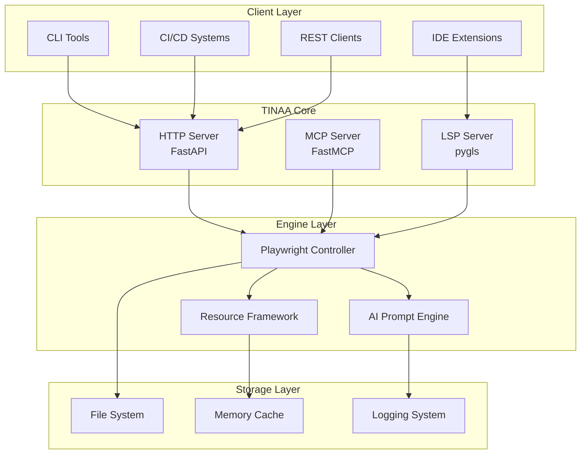

# TINAA Developer Guide
## Advanced Integration and Customization

*The definitive guide for developers who want to extend, customize, and integrate TINAA into their development workflows.*

---

## Table of Contents

1. [Architecture Overview](#architecture-overview)
2. [Local Development Setup](#local-development-setup)
3. [API Integration](#api-integration)
4. [Custom Resource Development](#custom-resource-development)
5. [Plugin Development](#plugin-development)
6. [Testing TINAA](#testing-tinaa)
7. [Performance Optimization](#performance-optimization)
8. [Security Considerations](#security-considerations)
9. [Deployment Strategies](#deployment-strategies)
10. [Contributing](#contributing)

---

## Architecture Overview

### System Components



### Core Technologies

| Component | Technology | Purpose |
|-----------|------------|---------|
| **HTTP Server** | FastAPI + uvicorn | REST API and WebSocket endpoints |
| **MCP Server** | FastMCP 2.8.0 | Model Context Protocol implementation |
| **LSP Server** | pygls | Language Server Protocol for IDE integration |
| **Browser Engine** | Playwright | Browser automation and testing |
| **Resource Framework** | JSON + Python | Extensible testing resources |
| **AI Integration** | Prompt templates | Test generation and analysis |

### Data Flow

```python
# Example request flow
async def exploratory_test_flow(url: str):
    # 1. Request validation
    request = TestRequest(url=url, type="exploratory")
    
    # 2. Browser initialization
    controller = await get_controller()
    
    # 3. Page analysis
    page_data = await controller.analyze_page(url)
    
    # 4. AI processing
    test_scenarios = await generate_tests(page_data)
    
    # 5. Test execution
    results = await execute_tests(test_scenarios)
    
    # 6. Response formatting
    return format_response(results)
```

---

## Local Development Setup

### Prerequisites

```bash
# Required tools
- Python 3.8+
- Node.js 18+
- Docker Desktop
- Git

# Recommended tools
- VS Code with Python extension
- Postman or similar API client
- Docker Compose
```

## Development Environment

```bash
# 1. Clone repository
git clone https://github.com/aj-geddes/tinaa-playwright-msp.git
cd tinaa-playwright-msp

# 2. Create virtual environment
python -m venv venv
source venv/bin/activate  # On Windows: venv\Scripts\activate

# 3. Install development dependencies
pip install -r requirements-dev.txt

# 4. Install pre-commit hooks
pre-commit install

# 5. Set up environment variables
cp .env.example .env
# Edit .env with your configuration
```

## Development Configuration

Create `config/development.json`:
```json
{
  "server": {
    "host": "0.0.0.0",
    "port": 8765,
    "reload": true,
    "log_level": "DEBUG"
  },
  "playwright": {
    "headless": false,
    "slow_mo": 1000,
    "timeout": 30000
  },
  "resources": {
    "auto_reload": true,
    "cache_ttl": 0
  },
  "testing": {
    "parallel_limit": 1,
    "screenshot_on_failure": true
  }
}
```

### Running in Development Mode

```bash
# Start with hot reload
python -m uvicorn app.http_server:app --reload --host 0.0.0.0 --port 8765

# Start with debug logging
LOG_LEVEL=DEBUG python app/http_server.py

# Start MCP server for Claude integration
python minimalist_mcp.py

# Start LSP server for IDE integration
python playwright_lsp/server.py --tcp --port 8766
```

---

## API Integration

### Client SDK Development

Create a Python client SDK:

```python
# tinaa_sdk.py
import asyncio
import aiohttp
import json
from typing import Dict, List, Optional, Union
from dataclasses import dataclass

@dataclass
class TinaaConfig:
    base_url: str = "http://localhost:8765"
    timeout: int = 300
    max_retries: int = 3

class TinaaClient:
    def __init__(self, config: TinaaConfig = None):
        self.config = config or TinaaConfig()
        self.session = None
    
    async def __aenter__(self):
        self.session = aiohttp.ClientSession(
            timeout=aiohttp.ClientTimeout(total=self.config.timeout)
        )
        return self
    
    async def __aexit__(self, exc_type, exc_val, exc_tb):
        if self.session:
            await self.session.close()
    
    async def health_check(self) -> Dict:
        """Check if TINAA is healthy and responsive."""
        async with self.session.get(f"{self.config.base_url}/health") as resp:
            return await resp.json()
    
    async def navigate(self, url: str) -> Dict:
        """Navigate to a URL."""
        async with self.session.post(
            f"{self.config.base_url}/navigate",
            json={"action": "navigate", "parameters": {"url": url}}
        ) as resp:
            return await resp.json()
    
    async def exploratory_test(
        self, 
        url: str, 
        focus_area: str = "general",
        callback: Optional[callable] = None
    ) -> Dict:
        """Run exploratory test with optional progress callback."""
        payload = {
            "action": "exploratory",
            "parameters": {"url": url, "focus_area": focus_area}
        }
        
        async with self.session.post(
            f"{self.config.base_url}/test/exploratory",
            json=payload
        ) as resp:
            if callback:
                # Stream processing for real-time updates
                async for chunk in resp.content.iter_chunked(1024):
                    if chunk:
                        try:
                            data = json.loads(chunk.decode())
                            callback(data)
                        except json.JSONDecodeError:
                            continue
            
            return await resp.json()
    
    async def accessibility_test(self, standard: str = "WCAG2.1-AA") -> Dict:
        """Run accessibility audit."""
        async with self.session.post(
            f"{self.config.base_url}/test/accessibility",
            json={"action": "accessibility", "parameters": {"standard": standard}}
        ) as resp:
            return await resp.json()
    
    async def execute_playbook(self, playbook: Dict) -> Dict:
        """Execute a test playbook."""
        async with self.session.post(
            f"{self.config.base_url}/playbook/execute",
            json=playbook
        ) as resp:
            return await resp.json()
    
    async def get_resource(self, resource_path: str) -> Dict:
        """Get a specific resource by path."""
        async with self.session.get(
            f"{self.config.base_url}/resources/{resource_path}"
        ) as resp:
            return await resp.json()

# Usage example
async def main():
    async with TinaaClient() as client:
        # Health check
        health = await client.health_check()
        print(f"TINAA Status: {health['status']}")
        
        # Run exploratory test
        def progress_callback(data):
            print(f"Progress: {data.get('phase', 'unknown')}")
        
        result = await client.exploratory_test(
            "https://example.com",
            focus_area="login",
            callback=progress_callback
        )
        
        print(f"Test completed: {result['success']}")

if __name__ == "__main__":
    asyncio.run(main())
```

## JavaScript/TypeScript SDK

```typescript
// tinaa-client.ts
interface TinaaConfig {
  baseUrl?: string;
  timeout?: number;
  maxRetries?: number;
}

interface TestRequest {
  action: string;
  parameters: Record<string, any>;
  client_id?: string;
}

interface TestResult {
  success: boolean;
  result: any;
  error?: string;
}

class TinaaClient {
  private config: Required<TinaaConfig>;
  
  constructor(config: TinaaConfig = {}) {
    this.config = {
      baseUrl: config.baseUrl || 'http://localhost:8765',
      timeout: config.timeout || 300000,
      maxRetries: config.maxRetries || 3
    };
  }
  
  async healthCheck(): Promise<any> {
    const response = await fetch(`${this.config.baseUrl}/health`);
    return response.json();
  }
  
  async navigate(url: string): Promise<TestResult> {
    return this.post('/navigate', {
      action: 'navigate',
      parameters: { url }
    });
  }
  
  async exploratoryTest(
    url: string, 
    focusArea: string = 'general',
    onProgress?: (data: any) => void
  ): Promise<TestResult> {
    const payload: TestRequest = {
      action: 'exploratory',
      parameters: { url, focus_area: focusArea }
    };
    
    if (onProgress) {
      return this.streamingPost('/test/exploratory', payload, onProgress);
    }
    
    return this.post('/test/exploratory', payload);
  }
  
  async accessibilityTest(standard: string = 'WCAG2.1-AA'): Promise<TestResult> {
    return this.post('/test/accessibility', {
      action: 'accessibility',
      parameters: { standard }
    });
  }
  
  async executePlaybook(playbook: any): Promise<TestResult> {
    return this.post('/playbook/execute', playbook);
  }
  
  async getResource(resourcePath: string): Promise<any> {
    const response = await fetch(`${this.config.baseUrl}/resources/${resourcePath}`);
    return response.json();
  }
  
  private async post(endpoint: string, data: any): Promise<TestResult> {
    const response = await fetch(`${this.config.baseUrl}${endpoint}`, {
      method: 'POST',
      headers: {
        'Content-Type': 'application/json'
      },
      body: JSON.stringify(data)
    });
    
    return response.json();
  }
  
  private async streamingPost(
    endpoint: string, 
    data: any, 
    onProgress: (data: any) => void
  ): Promise<TestResult> {
    const response = await fetch(`${this.config.baseUrl}${endpoint}`, {
      method: 'POST',
      headers: {
        'Content-Type': 'application/json'
      },
      body: JSON.stringify(data)
    });
    
    const reader = response.body?.getReader();
    let result: TestResult = { success: false, result: null };
    
    if (reader) {
      const decoder = new TextDecoder();
      
      try {
        while (true) {
          const { done, value } = await reader.read();
          
          if (done) break;
          
          const chunk = decoder.decode(value);
          try {
            const data = JSON.parse(chunk);
            onProgress(data);
            result = data;
          } catch (e) {
            // Partial JSON, continue reading
          }
        }
      } finally {
        reader.releaseLock();
      }
    }
    
    return result;
  }
}

// Usage example
const client = new TinaaClient();

async function runTests() {
  // Health check
  const health = await client.healthCheck();
  console.log('TINAA Status:', health.status);
  
  // Run exploratory test with progress
  const result = await client.exploratoryTest(
    'https://example.com',
    'login',
    (progress) => console.log('Progress:', progress.phase)
  );
  
  console.log('Test Result:', result);
}

runTests().catch(console.error);
```

---

## Custom Resource Development

### Resource Structure

```json
{
  "id": "custom-tool-example",
  "name": "Custom Tool Example",
  "description": "Template for creating custom TINAA resources",
  "version": "1.0.0",
  "type": "tool",
  "framework": "gofastmcp.com v2.8.0",
  "author": "Your Name",
  "license": "MIT",
  "tags": ["custom", "tool", "example"],
  "dependencies": {
    "playwright": ">=1.40.0",
    "python": ">=3.8"
  },
  "content": {
    "commands": [
      {
        "name": "setup",
        "description": "Setup custom tool",
        "script": "python setup_custom_tool.py"
      }
    ],
    "templates": {
      "test_template": "// Custom test template\ntest('{{test_name}}', async ({ page }) => {\n  // {{test_description}}\n});"
    },
    "configuration": {
      "default_timeout": 30000,
      "retry_attempts": 3
    }
  },
  "documentation": {
    "usage": "Instructions for using this resource",
    "examples": [
      {
        "title": "Basic Usage",
        "code": "curl -X POST http://localhost:8765/resources/custom-tool-example"
      }
    ]
  }
}
```

### Resource Development Workflow

1. **Create Resource Directory**
```bash
mkdir resources/tools/custom/my-custom-tool
cd resources/tools/custom/my-custom-tool
```

2. **Define Resource Specification**
```python
# resource_spec.py
from dataclasses import dataclass
from typing import Dict, List, Optional

@dataclass
class ResourceSpec:
    id: str
    name: str
    description: str
    version: str
    type: str  # tool, quickstart, example, documentation, prompt
    content: Dict
    dependencies: Optional[Dict] = None
    metadata: Optional[Dict] = None
    
    def to_json(self) -> Dict:
        return {
            "id": self.id,
            "name": self.name,
            "description": self.description,
            "version": self.version,
            "type": self.type,
            "framework": "gofastmcp.com v2.8.0",
            "content": self.content,
            "dependencies": self.dependencies or {},
            "metadata": self.metadata or {}
        }

# Define your custom resource
my_resource = ResourceSpec(
    id="advanced-form-tester",
    name="Advanced Form Testing Tool",
    description="Comprehensive form validation and testing utilities",
    version="1.0.0",
    type="tool",
    content={
        "commands": [
            {
                "name": "analyze_forms",
                "script": "python analyze_forms.py {{url}}"
            },
            {
                "name": "generate_form_tests",
                "script": "python generate_tests.py {{form_data}}"
            }
        ],
        "templates": {
            "form_test": """
test('Form validation - {{form_name}}', async ({ page }) => {
  await page.goto('{{url}}');
  
  // Test required field validation
  {{#required_fields}}
  await page.locator('{{selector}}').clear();
  await page.locator('form button[type="submit"]').click();
  await expect(page.locator('{{error_selector}}')).toBeVisible();
  {{/required_fields}}
  
  // Test valid form submission
  {{#form_fields}}
  await page.locator('{{selector}}').fill('{{test_value}}');
  {{/form_fields}}
  
  await page.locator('form button[type="submit"]').click();
  await expect(page).toHaveURL(/success/);
});
"""
        }
    },
    dependencies={
        "playwright": ">=1.40.0",
        "beautifulsoup4": ">=4.9.0"
    }
)

# Save resource
import json
with open("advanced-form-tester.json", "w") as f:
    json.dump(my_resource.to_json(), f, indent=2)
```

3. **Implement Resource Logic**
```python
# analyze_forms.py
import asyncio
import sys
from playwright.async_api import async_playwright
from bs4 import BeautifulSoup
import json

async def analyze_forms(url: str):
    """Analyze all forms on a page and extract testing data."""
    async with async_playwright() as p:
        browser = await p.chromium.launch()
        page = await browser.new_page()
        
        await page.goto(url)
        content = await page.content()
        await browser.close()
        
        soup = BeautifulSoup(content, 'html.parser')
        forms = soup.find_all('form')
        
        form_data = []
        for i, form in enumerate(forms):
            form_info = {
                "id": form.get('id', f'form-{i}'),
                "action": form.get('action', ''),
                "method": form.get('method', 'GET').upper(),
                "fields": []
            }
            
            # Analyze form fields
            inputs = form.find_all(['input', 'select', 'textarea'])
            for input_elem in inputs:
                field_info = {
                    "name": input_elem.get('name', ''),
                    "type": input_elem.get('type', 'text'),
                    "required": input_elem.has_attr('required'),
                    "selector": f"[name='{input_elem.get('name')}']",
                    "validation": extract_validation_rules(input_elem)
                }
                form_info["fields"].append(field_info)
            
            form_data.append(form_info)
        
        return form_data

def extract_validation_rules(element):
    """Extract validation rules from form element."""
    rules = {}
    
    if element.get('minlength'):
        rules['minlength'] = int(element.get('minlength'))
    if element.get('maxlength'):
        rules['maxlength'] = int(element.get('maxlength'))
    if element.get('pattern'):
        rules['pattern'] = element.get('pattern')
    if element.get('min'):
        rules['min'] = element.get('min')
    if element.get('max'):
        rules['max'] = element.get('max')
    
    return rules

if __name__ == "__main__":
    url = sys.argv[1]
    result = asyncio.run(analyze_forms(url))
    print(json.dumps(result, indent=2))
```

4. **Register Resource**
```python
# register_resource.py
import json
import os

def register_resource(resource_path: str):
    """Register a new resource in the TINAA index."""
    
    # Load resource
    with open(resource_path, 'r') as f:
        resource = json.load(f)
    
    # Load current index
    index_path = "../../index.json"
    with open(index_path, 'r') as f:
        index = json.load(f)
    
    # Add to appropriate category
    category = resource['type'] + 's'  # tool -> tools
    if category not in index['categories']:
        index['categories'][category] = {
            "name": category.title(),
            "description": f"Custom {category}",
            "resources": []
        }
    
    # Add resource entry
    resource_entry = {
        "id": resource['id'],
        "path": f"tools/custom/{resource['id']}.json",
        "type": resource['type'],
        "description": resource['description']
    }
    
    index['categories'][category]['resources'].append(resource_entry)
    
    # Save updated index
    with open(index_path, 'w') as f:
        json.dump(index, f, indent=2)
    
    print(f"Resource {resource['id']} registered successfully!")

if __name__ == "__main__":
    register_resource("advanced-form-tester.json")
```

## Testing Custom Resources

```python
# test_custom_resource.py
import pytest
import json
import asyncio
from unittest.mock import Mock, patch

@pytest.fixture
def sample_resource():
    return {
        "id": "test-resource",
        "name": "Test Resource",
        "type": "tool",
        "content": {
            "commands": [{"name": "test", "script": "echo test"}]
        }
    }

@pytest.mark.asyncio
async def test_resource_loading(sample_resource):
    """Test that custom resource loads correctly."""
    # Test resource validation
    assert sample_resource["id"] is not None
    assert sample_resource["type"] in ["tool", "quickstart", "example", "documentation", "prompt"]
    assert "content" in sample_resource

@pytest.mark.asyncio
async def test_resource_execution():
    """Test that resource commands execute correctly."""
    # Mock TINAA client
    with patch('tinaa_client.TinaaClient') as mock_client:
        mock_client.return_value.get_resource.return_value = {"success": True}
        
        # Test resource usage
        client = mock_client()
        result = await client.get_resource("tools/custom/test-resource.json")
        assert result["success"] is True

def test_resource_registration():
    """Test that resource can be registered in index."""
    # Test registration logic
    assert True  # Implement actual registration test
```

---

## Plugin Development

### Plugin Architecture

```python
# plugin_interface.py
from abc import ABC, abstractmethod
from typing import Dict, Any, Optional

class TinaaPlugin(ABC):
    """Base class for TINAA plugins."""
    
    @property
    @abstractmethod
    def name(self) -> str:
        """Plugin name."""
        pass
    
    @property
    @abstractmethod
    def version(self) -> str:
        """Plugin version."""
        pass
    
    @abstractmethod
    async def initialize(self, config: Dict[str, Any]) -> bool:
        """Initialize the plugin."""
        pass
    
    @abstractmethod
    async def execute(self, action: str, parameters: Dict[str, Any]) -> Dict[str, Any]:
        """Execute plugin action."""
        pass
    
    @abstractmethod
    async def cleanup(self) -> None:
        """Cleanup plugin resources."""
        pass

class TestGeneratorPlugin(TinaaPlugin):
    """Plugin for custom test generation."""
    
    @property
    def name(self) -> str:
        return "custom-test-generator"
    
    @property
    def version(self) -> str:
        return "1.0.0"
    
    async def initialize(self, config: Dict[str, Any]) -> bool:
        self.config = config
        self.ai_model = config.get('ai_model', 'default')
        return True
    
    async def execute(self, action: str, parameters: Dict[str, Any]) -> Dict[str, Any]:
        if action == "generate_tests":
            return await self.generate_tests(parameters)
        elif action == "analyze_requirements":
            return await self.analyze_requirements(parameters)
        else:
            raise ValueError(f"Unknown action: {action}")
    
    async def generate_tests(self, parameters: Dict[str, Any]) -> Dict[str, Any]:
        """Generate tests based on custom logic."""
        requirements = parameters.get('requirements', '')
        test_type = parameters.get('type', 'e2e')
        
        # Custom test generation logic
        generated_tests = []
        
        if test_type == 'e2e':
            generated_tests.append({
                "name": "End-to-End Test",
                "code": self.generate_e2e_test(requirements),
                "type": "playwright"
            })
        elif test_type == 'unit':
            generated_tests.append({
                "name": "Unit Test",
                "code": self.generate_unit_test(requirements),
                "type": "jest"
            })
        
        return {
            "success": True,
            "tests": generated_tests,
            "metadata": {
                "generator": self.name,
                "version": self.version
            }
        }
    
    def generate_e2e_test(self, requirements: str) -> str:
        """Generate Playwright E2E test code."""
        return f"""
import {{ test, expect }} from '@playwright/test';

test('Generated test from requirements', async ({{ page }}) => {{
  // Requirements: {requirements}
  
  // Navigate to application
  await page.goto('/');
  
  // Add test steps based on requirements
  // This would be generated by AI or custom logic
  
  // Verify expected outcome
  await expect(page.locator('[data-testid="success"]')).toBeVisible();
}});
"""
    
    def generate_unit_test(self, requirements: str) -> str:
        """Generate unit test code."""
        return f"""
describe('Generated unit test', () => {{
  it('should meet requirements', () => {{
    // Requirements: {requirements}
    
    // Test implementation
    expect(true).toBe(true);
  }});
}});
"""
    
    async def analyze_requirements(self, parameters: Dict[str, Any]) -> Dict[str, Any]:
        """Analyze requirements for test generation."""
        requirements_text = parameters.get('requirements', '')
        
        # Simple keyword analysis (would be more sophisticated in practice)
        keywords = requirements_text.lower().split()
        
        test_suggestions = []
        if 'login' in keywords:
            test_suggestions.append('authentication_flow')
        if 'form' in keywords:
            test_suggestions.append('form_validation')
        if 'search' in keywords:
            test_suggestions.append('search_functionality')
        
        return {
            "success": True,
            "analysis": {
                "keywords": keywords,
                "suggested_tests": test_suggestions,
                "complexity": len(keywords) // 10 + 1  # Simple complexity metric
            }
        }
    
    async def cleanup(self) -> None:
        """Cleanup resources."""
        pass
```

## Plugin Manager

```python
# plugin_manager.py
import os
import importlib
import asyncio
from typing import Dict, List, Optional
from plugin_interface import TinaaPlugin

class PluginManager:
    """Manages TINAA plugins."""
    
    def __init__(self):
        self.plugins: Dict[str, TinaaPlugin] = {}
        self.plugin_configs: Dict[str, Dict] = {}
    
    async def load_plugins(self, plugin_dir: str = "plugins"):
        """Load all plugins from directory."""
        if not os.path.exists(plugin_dir):
            return
        
        for filename in os.listdir(plugin_dir):
            if filename.endswith('.py') and not filename.startswith('__'):
                module_name = filename[:-3]
                await self.load_plugin(plugin_dir, module_name)
    
    async def load_plugin(self, plugin_dir: str, module_name: str):
        """Load a single plugin."""
        try:
            # Import plugin module
            spec = importlib.util.spec_from_file_location(
                module_name, 
                os.path.join(plugin_dir, f"{module_name}.py")
            )
            module = importlib.util.module_from_spec(spec)
            spec.loader.exec_module(module)
            
            # Find plugin class
            for attr_name in dir(module):
                attr = getattr(module, attr_name)
                if (isinstance(attr, type) and 
                    issubclass(attr, TinaaPlugin) and 
                    attr != TinaaPlugin):
                    
                    # Instantiate and initialize plugin
                    plugin = attr()
                    config = self.plugin_configs.get(plugin.name, {})
                    
                    if await plugin.initialize(config):
                        self.plugins[plugin.name] = plugin
                        print(f"Loaded plugin: {plugin.name} v{plugin.version}")
                    else:
                        print(f"Failed to initialize plugin: {plugin.name}")
                    break
        
        except Exception as e:
            print(f"Error loading plugin {module_name}: {e}")
    
    async def execute_plugin(self, plugin_name: str, action: str, parameters: Dict) -> Dict:
        """Execute action on specific plugin."""
        if plugin_name not in self.plugins:
            raise ValueError(f"Plugin not found: {plugin_name}")
        
        plugin = self.plugins[plugin_name]
        return await plugin.execute(action, parameters)
    
    def get_plugin_info(self) -> List[Dict]:
        """Get information about all loaded plugins."""
        return [
            {
                "name": plugin.name,
                "version": plugin.version,
                "actions": getattr(plugin, 'supported_actions', [])
            }
            for plugin in self.plugins.values()
        ]
    
    async def cleanup_plugins(self):
        """Cleanup all plugins."""
        for plugin in self.plugins.values():
            await plugin.cleanup()

# Integration with HTTP server
# Add to app/http_server.py

plugin_manager = PluginManager()

@app.on_event("startup")
async def startup_event():
    await plugin_manager.load_plugins()

@app.post("/plugins/{plugin_name}/execute")
async def execute_plugin(plugin_name: str, request: Dict):
    try:
        result = await plugin_manager.execute_plugin(
            plugin_name, 
            request.get('action'), 
            request.get('parameters', {})
        )
        return {"success": True, "result": result}
    except Exception as e:
        return {"success": False, "error": str(e)}

@app.get("/plugins")
async def list_plugins():
    return plugin_manager.get_plugin_info()
```

---

## Testing TINAA

### Unit Testing

```python
# tests/unit/test_core_functionality.py
import pytest
import asyncio
from unittest.mock import Mock, patch, AsyncMock
from app.http_server import app
from fastapi.testclient import TestClient
from playwright_controller.controller import PlaywrightController

class TestTinaaCore:
    @pytest.fixture
    def client(self):
        return TestClient(app)
    
    @pytest.fixture
    async def mock_controller(self):
        controller = Mock(spec=PlaywrightController)
        controller.initialize = AsyncMock(return_value=True)
        controller.is_initialized = True
        controller.navigate = AsyncMock(return_value={"success": True, "url": "test"})
        return controller
    
    def test_health_endpoint(self, client):
        """Test health check endpoint."""
        response = client.get("/health")
        assert response.status_code == 200
        assert response.json()["status"] == "healthy"
    
    @patch('app.http_server.get_controller')
    def test_navigation_endpoint(self, mock_get_controller, client, mock_controller):
        """Test navigation endpoint."""
        mock_get_controller.return_value = mock_controller
        
        response = client.post("/navigate", json={
            "action": "navigate",
            "parameters": {"url": "https://example.com"}
        })
        
        assert response.status_code == 200
        data = response.json()
        assert data["success"] is True
    
    @pytest.mark.asyncio
    async def test_controller_initialization(self, mock_controller):
        """Test controller initialization."""
        result = await mock_controller.initialize()
        assert result is True
        assert mock_controller.is_initialized is True
    
    def test_resource_loading(self, client):
        """Test resource loading."""
        response = client.get("/resources/index.json")
        assert response.status_code == 200
        data = response.json()
        assert "categories" in data
        assert "tools" in data["categories"]
```

## Integration Testing

```python
# tests/integration/test_full_workflow.py
import pytest
import asyncio
import json
from playwright.async_api import async_playwright
from tinaa_sdk import TinaaClient, TinaaConfig

class TestFullWorkflow:
    @pytest.fixture
    async def tinaa_client(self):
        config = TinaaConfig(base_url="http://localhost:8765")
        async with TinaaClient(config) as client:
            yield client
    
    @pytest.fixture
    async def test_server(self):
        """Start a simple test server for testing."""
        from aiohttp import web
        
        async def hello_handler(request):
            return web.Response(text="Hello, World!")
        
        app = web.Application()
        app.router.add_get('/', hello_handler)
        
        runner = web.AppRunner(app)
        await runner.setup()
        site = web.TCPSite(runner, 'localhost', 8080)
        await site.start()
        
        yield "http://localhost:8080"
        
        await runner.cleanup()
    
    @pytest.mark.asyncio
    async def test_complete_testing_workflow(self, tinaa_client, test_server):
        """Test complete workflow from navigation to test generation."""
        
        # 1. Health check
        health = await tinaa_client.health_check()
        assert health["status"] == "healthy"
        
        # 2. Navigate to test page
        nav_result = await tinaa_client.navigate(test_server)
        assert nav_result["success"] is True
        
        # 3. Run exploratory test
        progress_updates = []
        def track_progress(data):
            progress_updates.append(data)
        
        test_result = await tinaa_client.exploratory_test(
            test_server, 
            focus_area="general",
            callback=track_progress
        )
        
        assert test_result["success"] is True
        assert len(progress_updates) > 0
        
        # 4. Run accessibility test
        accessibility_result = await tinaa_client.accessibility_test()
        assert accessibility_result["success"] is True
        
        # 5. Get test generation resource
        resource = await tinaa_client.get_resource("prompts/test-generator.json")
        assert resource["id"] == "test-generator"
    
    @pytest.mark.asyncio
    async def test_playbook_execution(self, tinaa_client, test_server):
        """Test playbook execution workflow."""
        
        playbook = {
            "name": "Test Playbook",
            "client_id": "test-client",
            "steps": [
                {
                    "id": "step-1",
                    "action": "navigate",
                    "parameters": {"url": test_server}
                },
                {
                    "id": "step-2",
                    "action": "screenshot",
                    "parameters": {"full_page": True}
                }
            ]
        }
        
        result = await tinaa_client.execute_playbook(playbook)
        assert result["success"] is True
        assert len(result["results"]) == 2
```

## Performance Testing

```python
# tests/performance/test_load.py
import pytest
import asyncio
import time
from concurrent.futures import ThreadPoolExecutor
import aiohttp

class TestPerformance:
    @pytest.mark.asyncio
    async def test_concurrent_requests(self):
        """Test TINAA performance under concurrent load."""
        
        async def make_request(session, url):
            start_time = time.time()
            async with session.get(url) as response:
                await response.json()
            return time.time() - start_time
        
        # Test with multiple concurrent health checks
        connector = aiohttp.TCPConnector(limit=100)
        async with aiohttp.ClientSession(connector=connector) as session:
            tasks = [
                make_request(session, "http://localhost:8765/health")
                for _ in range(50)
            ]
            
            response_times = await asyncio.gather(*tasks)
            
            # Performance assertions
            avg_response_time = sum(response_times) / len(response_times)
            max_response_time = max(response_times)
            
            assert avg_response_time < 1.0  # Average under 1 second
            assert max_response_time < 5.0  # Max under 5 seconds
            assert all(t > 0 for t in response_times)  # All requests successful
    
    @pytest.mark.asyncio
    async def test_memory_usage(self):
        """Test memory usage during test execution."""
        import psutil
        import os
        
        process = psutil.Process(os.getpid())
        initial_memory = process.memory_info().rss
        
        # Run multiple test operations
        async with aiohttp.ClientSession() as session:
            for _ in range(10):
                async with session.post(
                    "http://localhost:8765/test/exploratory",
                    json={
                        "action": "exploratory",
                        "parameters": {"url": "https://example.com"}
                    }
                ) as response:
                    await response.json()
        
        final_memory = process.memory_info().rss
        memory_increase = final_memory - initial_memory
        
        # Memory should not increase by more than 100MB
        assert memory_increase < 100 * 1024 * 1024
```

## End-to-End Testing

```python
# tests/e2e/test_real_world_scenarios.py
import pytest
from playwright.async_api import async_playwright

class TestRealWorldScenarios:
    @pytest.mark.asyncio
    async def test_github_repository_analysis(self):
        """Test TINAA analyzing a real GitHub repository page."""
        
        # This test requires TINAA to be running
        async with async_playwright() as p:
            browser = await p.chromium.launch()
            page = await browser.new_page()
            
            # Use TINAA to analyze GitHub
            import aiohttp
            async with aiohttp.ClientSession() as session:
                # Run exploratory test on GitHub
                async with session.post(
                    "http://localhost:8765/test/exploratory",
                    json={
                        "action": "exploratory",
                        "parameters": {
                            "url": "https://github.com/microsoft/playwright",
                            "focus_area": "navigation"
                        }
                    }
                ) as response:
                    result = await response.json()
                    
                    assert result["success"] is True
                    assert "test_scenarios" in result["result"]
                    assert len(result["result"]["test_scenarios"]) > 0
                    
                    # Verify generated test code
                    scenarios = result["result"]["test_scenarios"]
                    assert any("navigate" in scenario["name"].lower() for scenario in scenarios)
            
            await browser.close()
```

---

## Performance Optimization

### Caching Strategies

```python
# app/cache_manager.py
import asyncio
import json
import time
from typing import Dict, Any, Optional
from dataclasses import dataclass
import hashlib

@dataclass
class CacheEntry:
    data: Any
    timestamp: float
    ttl: int  # Time to live in seconds
    
    @property
    def is_expired(self) -> bool:
        return time.time() - self.timestamp > self.ttl

class TinaaCache:
    """Intelligent caching system for TINAA."""
    
    def __init__(self):
        self._cache: Dict[str, CacheEntry] = {}
        self._default_ttl = 300  # 5 minutes
        
    def _generate_key(self, prefix: str, *args) -> str:
        """Generate cache key from prefix and arguments."""
        key_data = f"{prefix}:{':'.join(str(arg) for arg in args)}"
        return hashlib.md5(key_data.encode()).hexdigest()
    
    async def get(self, key: str) -> Optional[Any]:
        """Get cached value if not expired."""
        if key in self._cache:
            entry = self._cache[key]
            if not entry.is_expired:
                return entry.data
            else:
                del self._cache[key]
        return None
    
    async def set(self, key: str, value: Any, ttl: Optional[int] = None) -> None:
        """Set cached value with TTL."""
        ttl = ttl or self._default_ttl
        self._cache[key] = CacheEntry(
            data=value,
            timestamp=time.time(),
            ttl=ttl
        )
    
    async def get_or_compute(self, key: str, compute_func, ttl: Optional[int] = None) -> Any:
        """Get cached value or compute and cache it."""
        cached_value = await self.get(key)
        if cached_value is not None:
            return cached_value
        
        computed_value = await compute_func()
        await self.set(key, computed_value, ttl)
        return computed_value
    
    def clear_expired(self) -> int:
        """Clear all expired cache entries."""
        expired_keys = [
            key for key, entry in self._cache.items()
            if entry.is_expired
        ]
        
        for key in expired_keys:
            del self._cache[key]
        
        return len(expired_keys)
    
    async def clear_all(self) -> None:
        """Clear all cache entries."""
        self._cache.clear()

# Cache implementation in services
cache = TinaaCache()

async def cached_page_analysis(url: str) -> Dict:
    """Cached page analysis to avoid redundant processing."""
    cache_key = cache._generate_key("page_analysis", url)
    
    async def analyze_page():
        # Actual page analysis logic
        controller = await get_controller()
        return await controller.analyze_page_structure(url)
    
    return await cache.get_or_compute(cache_key, analyze_page, ttl=600)  # 10 minutes

async def cached_resource_load(resource_path: str) -> Dict:
    """Cache resource loading."""
    cache_key = cache._generate_key("resource", resource_path)
    
    async def load_resource():
        with open(f"resources/{resource_path}", 'r') as f:
            return json.load(f)
    
    return await cache.get_or_compute(cache_key, load_resource, ttl=3600)  # 1 hour
```

## Connection Pooling

```python
# app/connection_pool.py
import asyncio
from typing import Dict, List
from playwright.async_api import async_playwright, Browser, BrowserContext, Page

class BrowserPool:
    """Pool of browser instances for better performance."""
    
    def __init__(self, pool_size: int = 3):
        self.pool_size = pool_size
        self.browsers: List[Browser] = []
        self.contexts: Dict[str, BrowserContext] = {}
        self.available_browsers = asyncio.Queue()
        self._playwright = None
    
    async def initialize(self):
        """Initialize browser pool."""
        self._playwright = await async_playwright().start()
        
        for i in range(self.pool_size):
            browser = await self._playwright.chromium.launch(
                headless=True,
                args=['--no-sandbox', '--disable-dev-shm-usage']
            )
            self.browsers.append(browser)
            await self.available_browsers.put(browser)
    
    async def get_browser(self) -> Browser:
        """Get available browser from pool."""
        return await self.available_browsers.get()
    
    async def return_browser(self, browser: Browser):
        """Return browser to pool."""
        await self.available_browsers.put(browser)
    
    async def get_context(self, session_id: str) -> BrowserContext:
        """Get or create browser context for session."""
        if session_id not in self.contexts:
            browser = await self.get_browser()
            context = await browser.new_context()
            self.contexts[session_id] = context
            await self.return_browser(browser)
        
        return self.contexts[session_id]
    
    async def cleanup_context(self, session_id: str):
        """Cleanup browser context."""
        if session_id in self.contexts:
            await self.contexts[session_id].close()
            del self.contexts[session_id]
    
    async def cleanup(self):
        """Cleanup all resources."""
        for context in self.contexts.values():
            await context.close()
        
        for browser in self.browsers:
            await browser.close()
        
        if self._playwright:
            await self._playwright.stop()

# Usage in controller
browser_pool = BrowserPool(pool_size=5)

class OptimizedPlaywrightController:
    async def initialize(self):
        await browser_pool.initialize()
    
    async def navigate_with_pool(self, url: str, session_id: str = "default"):
        """Navigate using pooled browser context."""
        context = await browser_pool.get_context(session_id)
        page = await context.new_page()
        
        try:
            await page.goto(url, wait_until='networkidle')
            return await page.content()
        finally:
            await page.close()
```

## Asynchronous Processing

```python
# app/async_processor.py
import asyncio
from typing import List, Dict, Any, Callable
from concurrent.futures import ThreadPoolExecutor
import functools

class AsyncTaskProcessor:
    """Handle CPU-intensive tasks asynchronously."""
    
    def __init__(self, max_workers: int = 4):
        self.executor = ThreadPoolExecutor(max_workers=max_workers)
        self.task_queue = asyncio.Queue()
        self.processing = False
    
    async def submit_task(self, func: Callable, *args, **kwargs) -> Any:
        """Submit CPU-intensive task to thread pool."""
        loop = asyncio.get_event_loop()
        
        # Wrap synchronous function for thread execution
        if asyncio.iscoroutinefunction(func):
            raise ValueError("Use async functions directly, not with thread pool")
        
        partial_func = functools.partial(func, *args, **kwargs)
        return await loop.run_in_executor(self.executor, partial_func)
    
    async def process_batch(self, tasks: List[Dict[str, Any]]) -> List[Any]:
        """Process multiple tasks concurrently."""
        async def execute_task(task):
            func = task['function']
            args = task.get('args', [])
            kwargs = task.get('kwargs', {})
            
            if asyncio.iscoroutinefunction(func):
                return await func(*args, **kwargs)
            else:
                return await self.submit_task(func, *args, **kwargs)
        
        return await asyncio.gather(*[execute_task(task) for task in tasks])
    
    def cleanup(self):
        """Cleanup thread pool."""
        self.executor.shutdown(wait=True)

# Usage for heavy computations
async_processor = AsyncTaskProcessor()

async def parallel_page_analysis(urls: List[str]) -> List[Dict]:
    """Analyze multiple pages in parallel."""
    
    async def analyze_single_page(url: str) -> Dict:
        controller = await get_controller()
        return await controller.analyze_page_structure(url)
    
    tasks = [
        {'function': analyze_single_page, 'args': [url]}
        for url in urls
    ]
    
    return await async_processor.process_batch(tasks)

def cpu_intensive_selector_optimization(selectors: List[str]) -> List[str]:
    """CPU-intensive selector optimization (runs in thread pool)."""
    # Complex selector analysis logic
    optimized = []
    for selector in selectors:
        # Simulate CPU-intensive work
        optimized.append(selector.replace(' ', ' > '))
    return optimized

async def optimize_selectors_async(selectors: List[str]) -> List[str]:
    """Optimize selectors using thread pool."""
    return await async_processor.submit_task(
        cpu_intensive_selector_optimization, 
        selectors
    )
```

---

## Security Considerations

### Authentication & Authorization

```python
# app/security.py
import jwt
import hashlib
import secrets
from datetime import datetime, timedelta
from typing import Optional, Dict
from fastapi import HTTPException, Depends, status
from fastapi.security import HTTPBearer, HTTPAuthorizationCredentials

class SecurityManager:
    """Manage authentication and authorization for TINAA."""
    
    def __init__(self, secret_key: str = None):
        self.secret_key = secret_key or secrets.token_urlsafe(32)
        self.algorithm = "HS256"
        self.access_token_expire_minutes = 30
        
    def create_access_token(self, data: Dict, expires_delta: Optional[timedelta] = None):
        """Create JWT access token."""
        to_encode = data.copy()
        
        if expires_delta:
            expire = datetime.utcnow() + expires_delta
        else:
            expire = datetime.utcnow() + timedelta(minutes=self.access_token_expire_minutes)
        
        to_encode.update({"exp": expire})
        return jwt.encode(to_encode, self.secret_key, algorithm=self.algorithm)
    
    def verify_token(self, token: str) -> Dict:
        """Verify and decode JWT token."""
        try:
            payload = jwt.decode(token, self.secret_key, algorithms=[self.algorithm])
            return payload
        except jwt.PyJWTError:
            raise HTTPException(
                status_code=status.HTTP_401_UNAUTHORIZED,
                detail="Could not validate credentials"
            )
    
    def hash_api_key(self, api_key: str) -> str:
        """Hash API key for secure storage."""
        return hashlib.sha256(api_key.encode()).hexdigest()
    
    def generate_api_key(self) -> str:
        """Generate new API key."""
        return secrets.token_urlsafe(32)

security = HTTPBearer()
security_manager = SecurityManager()

async def verify_api_key(credentials: HTTPAuthorizationCredentials = Depends(security)):
    """Verify API key from Authorization header."""
    api_key = credentials.credentials
    
    # In production, check against database of valid API keys
    valid_keys = ["your-api-key-here"]  # Replace with database lookup
    
    if api_key not in valid_keys:
        raise HTTPException(
            status_code=status.HTTP_401_UNAUTHORIZED,
            detail="Invalid API key"
        )
    
    return api_key

# Protected endpoints
@app.post("/test/exploratory")
async def exploratory_test(
    request: TestRequest,
    api_key: str = Depends(verify_api_key)
):
    """Protected exploratory test endpoint."""
    # Implementation with security
    pass
```

## Input Validation & Sanitization

```python
# app/validation.py
import re
from typing import List, Dict, Any
from urllib.parse import urlparse
from pydantic import BaseModel, validator, Field

class SecureTestRequest(BaseModel):
    """Secure test request with validation."""
    
    url: str = Field(..., description="Target URL for testing")
    parameters: Dict[str, Any] = Field(default_factory=dict)
    client_id: Optional[str] = Field(None, regex=r'^[a-zA-Z0-9\-_]+$')
    
    @validator('url')
    def validate_url(cls, v):
        """Validate and sanitize URL."""
        if not v:
            raise ValueError('URL is required')
        
        # Parse URL
        parsed = urlparse(v)
        
        # Check scheme
        if parsed.scheme not in ['http', 'https']:
            raise ValueError('Only HTTP and HTTPS URLs are allowed')
        
        # Check for suspicious patterns
        suspicious_patterns = [
            r'javascript:',
            r'data:',
            r'file:',
            r'ftp:',
        ]
        
        for pattern in suspicious_patterns:
            if re.search(pattern, v, re.IGNORECASE):
                raise ValueError('Suspicious URL pattern detected')
        
        # Limit URL length
        if len(v) > 2048:
            raise ValueError('URL too long')
        
        return v
    
    @validator('parameters')
    def validate_parameters(cls, v):
        """Validate parameters for security."""
        if not isinstance(v, dict):
            raise ValueError('Parameters must be a dictionary')
        
        # Limit parameter count
        if len(v) > 50:
            raise ValueError('Too many parameters')
        
        # Validate parameter values
        for key, value in v.items():
            if isinstance(value, str) and len(value) > 1000:
                raise ValueError(f'Parameter {key} value too long')
        
        return v

class SecurePlaybookRequest(BaseModel):
    """Secure playbook request."""
    
    name: str = Field(..., min_length=1, max_length=100)
    steps: List[Dict[str, Any]] = Field(..., max_items=20)
    client_id: str = Field(..., regex=r'^[a-zA-Z0-9\-_]+$')
    
    @validator('steps')
    def validate_steps(cls, v):
        """Validate playbook steps."""
        allowed_actions = [
            'navigate', 'screenshot', 'fill_form',
            'test_exploratory', 'test_accessibility',
            'test_responsive', 'test_security'
        ]
        
        for step in v:
            if 'action' not in step:
                raise ValueError('Each step must have an action')
            
            if step['action'] not in allowed_actions:
                raise ValueError(f'Invalid action: {step["action"]}')
        
        return v

def sanitize_html_input(text: str) -> str:
    """Sanitize HTML input to prevent XSS."""
    import html
    return html.escape(text)

def validate_selector(selector: str) -> bool:
    """Validate CSS selector for safety."""
    # Prevent dangerous selectors
    dangerous_patterns = [
        r'javascript:',
        r'expression\(',
        r'@import',
        r'url\(',
    ]
    
    for pattern in dangerous_patterns:
        if re.search(pattern, selector, re.IGNORECASE):
            return False
    
    return True
```

## Rate Limiting

```python
# app/rate_limiter.py
import time
import asyncio
from typing import Dict, Optional
from collections import defaultdict, deque
from fastapi import HTTPException, Request

class RateLimiter:
    """Token bucket rate limiter."""
    
    def __init__(self, requests_per_minute: int = 60):
        self.requests_per_minute = requests_per_minute
        self.requests_per_second = requests_per_minute / 60
        self.buckets: Dict[str, deque] = defaultdict(deque)
    
    async def is_allowed(self, client_id: str) -> bool:
        """Check if request is allowed for client."""
        now = time.time()
        bucket = self.buckets[client_id]
        
        # Remove old requests (older than 1 minute)
        while bucket and bucket[0] <= now - 60:
            bucket.popleft()
        
        # Check if under limit
        if len(bucket) < self.requests_per_minute:
            bucket.append(now)
            return True
        
        return False
    
    async def wait_time(self, client_id: str) -> float:
        """Get wait time until next request is allowed."""
        bucket = self.buckets[client_id]
        if not bucket:
            return 0
        
        oldest_request = bucket[0]
        wait_time = max(0, oldest_request + 60 - time.time())
        return wait_time

# Global rate limiter
rate_limiter = RateLimiter(requests_per_minute=100)

async def rate_limit_middleware(request: Request, call_next):
    """Rate limiting middleware."""
    # Get client identifier
    client_ip = request.client.host
    api_key = request.headers.get('authorization', '').replace('Bearer ', '')
    client_id = api_key if api_key else client_ip
    
    # Check rate limit
    if not await rate_limiter.is_allowed(client_id):
        wait_time = await rate_limiter.wait_time(client_id)
        raise HTTPException(
            status_code=429,
            detail=f"Rate limit exceeded. Try again in {wait_time:.1f} seconds",
            headers={"Retry-After": str(int(wait_time + 1))}
        )
    
    response = await call_next(request)
    return response

# Add middleware to app
app.middleware("http")(rate_limit_middleware)
```

---

## Deployment Strategies

### Development Deployment

```bash
# Local development
docker-compose -f docker-compose.dev.yml up

# Development server with hot reload
python app/http_server.py --reload --debug
```

## Staging Deployment

```yaml
# docker-compose.staging.yml
version: '3.8'
services:
  tinaa:
    image: tinaa:staging
    environment:
      - ENV=staging
      - LOG_LEVEL=debug
    volumes:
      - ./config/staging:/app/config
```

## Production Deployment

See the [Enterprise Guide](ENTERPRISE_GUIDE.md) for comprehensive production deployment strategies including:
- Kubernetes deployment
- Docker Swarm deployment
- Auto-scaling configurations
- High availability setups

---

## Contributing

### Getting Started

1. **Fork the Repository**
   ```bash
   git clone https://github.com/yourusername/tinaa-playwright-msp.git
   cd tinaa-playwright-msp
   ```

2. **Create a Feature Branch**
   ```bash
   git checkout -b feature/your-feature-name
   ```

3. **Install Development Dependencies**
   ```bash
   pip install -r requirements-dev.txt
   pre-commit install
   ```

### Development Guidelines

1. **Code Style**
   - Follow PEP 8 for Python code
   - Use type hints for all functions
   - Add docstrings to all public methods

2. **Testing Requirements**
   - Write tests for all new features
   - Maintain >80% test coverage
   - Run tests before submitting PR

3. **Documentation**
   - Update relevant documentation
   - Add examples for new features
   - Update API documentation

### Submitting Pull Requests

1. **Run Quality Checks**
   ```bash
   make lint
   make test
   make coverage
   ```

2. **Create Pull Request**
   - Clear description of changes
   - Link related issues
   - Include test results

3. **Code Review Process**
   - Address reviewer feedback
   - Keep PR focused and small
   - Update branch with main

---

This developer guide provides comprehensive technical documentation for extending, customizing, and integrating TINAA. It covers architecture, development setup, API integration, custom resource development, plugin systems, testing strategies, performance optimization, and security considerations.

The guide enables developers to:
- Understand TINAA's internal architecture
- Set up local development environments
- Create custom resources and plugins
- Implement comprehensive testing
- Optimize performance for production
- Secure deployments appropriately
- Contribute effectively to the project

Each section includes practical code examples and best practices for enterprise-grade development.