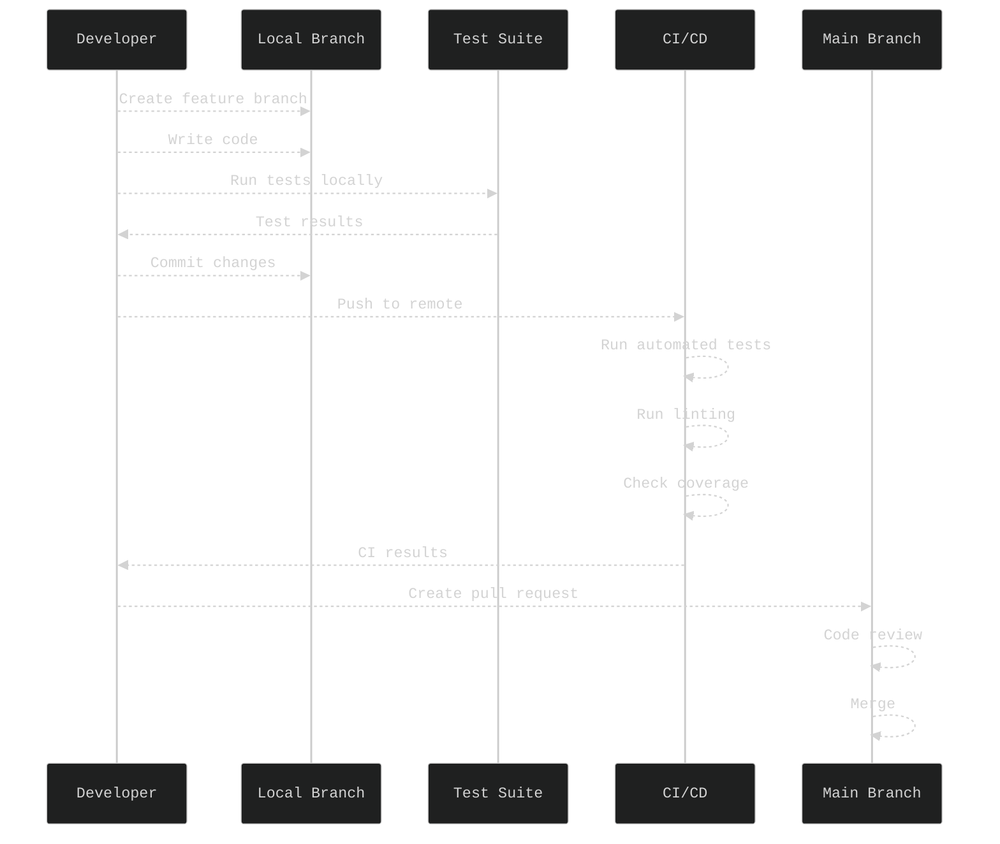
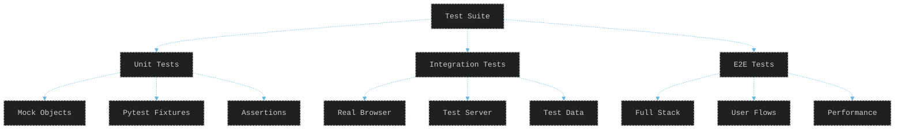
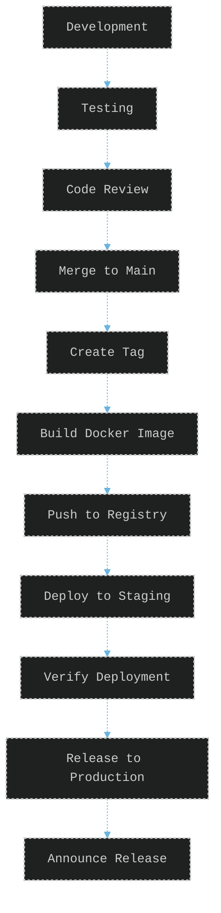

# TINAA Development Guide

## Getting Started

This guide helps developers understand and contribute to the TINAA project.

## Development Environment Setup

### Prerequisites

- Python 3.9+
- Docker and Docker Compose
- Git
- Text editor or IDE with Python support

### Local Setup

1. **Clone the repository**
   ```bash
   git clone https://github.com/aj-geddes/tinaa-playwright-msp.git
   cd tinaa-playwright-msp
   ```

2. **Create virtual environment**
   ```bash
   python -m venv venv
   source venv/bin/activate  # On Windows: venv\Scripts\activate
   ```

3. **Install dependencies**
   ```bash
   pip install -r requirements.txt
   pip install -r requirements-dev.txt
   ```

4. **Install Playwright browsers**
   ```bash
   playwright install chromium
   ```

## Project Structure

```mermaid
%%{init: {
  'theme': 'dark',
  'themeVariables': {
    'fontFamily': 'monospace',
    'primaryBorderColor': '#6BB4DD',
    'primaryColor': '#2D3A4D',
    'primaryTextColor': '#fff',
    'lineColor': '#6BB4DD'
  },
  'themeCSS': '.node rect, .node circle, .node polygon { stroke-width: 2px; stroke-dasharray: 3,3; }'
}}%%
flowchart TD
    Root[tinaa-playwright-msp/] -.-> App[app/<br/>Main application]
    Root -.-> Controller[playwright_controller/<br/>Browser automation]
    Root -.-> LSP[playwright_lsp/<br/>Language server]
    Root -.-> Resources[resources/<br/>Test patterns]
    Root -.-> Tools[tools/<br/>Modular tools]
    Root -.-> Tests[tests/<br/>Test suite]
    Root -.-> Scripts[scripts/<br/>Build scripts]
    
    App -.-> Main[main.py<br/>MCP server]
    App -.-> HTTP[http_server.py<br/>HTTP API]
    App -.-> Progress[progress_tracker.py<br/>Progress system]
    App -.-> Loader[resource_loader.py<br/>Resource management]
    
    Controller -.-> ControllerPy[controller.py<br/>Playwright wrapper]
    
    LSP -.-> Server[server.py<br/>LSP implementation]
    LSP -.-> Handlers[handlers/<br/>Request handlers]
    
    Resources -.-> JSON[*.json<br/>Configuration files]
    
    Tests -.-> Unit[unit/<br/>Unit tests]
    Tests -.-> Integration[integration/<br/>Integration tests]
    Tests -.-> E2E[e2e/<br/>End-to-end tests]
```



## Code Architecture

### Core Components

#### 1. MCP Server (`app/main.py`)

The main entry point for MCP mode. Uses FastMCP framework to expose tools.

```python
from fastmcp import FastMCP, Context

mcp = FastMCP("TINAA - Testing Intelligence Network Automation Assistant")

@mcp.tool()
async def tool_name(param: str, ctx: Context = None) -> str:
    """Tool documentation"""
    # Implementation
    pass
```

#### 2. HTTP Server (`app/http_server.py`)

FastAPI-based HTTP server with WebSocket support.

```python
from fastapi import FastAPI, WebSocket
from fastapi.responses import StreamingResponse

app = FastAPI()

@app.post("/endpoint")
async def endpoint(request: RequestModel):
    # Implementation
    pass
```

#### 3. Playwright Controller (`playwright_controller/controller.py`)

Manages browser automation and test execution.

```python
class PlaywrightController:
    async def initialize(self, viewport_size=None):
        self.playwright = await async_playwright().start()
        self.browser = await self.playwright.chromium.launch()
        # ...
```

#### 4. Progress Tracker (`app/progress_tracker.py`)

Provides real-time progress updates for long-running operations.

```python
class ProgressTracker:
    async def update_progress(self, category, phase, message, data=None):
        # Thread-safe progress updates
        pass
```

## Development Workflow



## Adding New Features

### 1. Adding a New MCP Tool

Create new tool in `app/main.py`:

```python
@mcp.tool()
async def new_tool_name(
    param1: str,
    param2: int = 10,
    ctx: Context = None
) -> str:
    """
    Tool description for MCP catalog.
    
    Args:
        param1: Description of param1
        param2: Description of param2
        ctx: Execution context
    
    Returns:
        Result description
    """
    try:
        # Initialize controller if needed
        controller = await get_or_create_controller()
        
        # Implement tool logic
        result = await controller.some_method(param1, param2)
        
        # Return formatted result
        return format_tool_response(result)
        
    except Exception as e:
        logger.error(f"Error in new_tool: {e}")
        return f"Error: {str(e)}"
```

### 2. Adding HTTP Endpoints

Add endpoint in `app/http_server.py`:

```python
@app.post("/new-endpoint")
async def new_endpoint(request: NewRequestModel):
    """API endpoint documentation"""
    try:
        controller = get_controller()
        result = await controller.process_request(request)
        return {"status": "success", "data": result}
    except Exception as e:
        raise HTTPException(status_code=500, detail=str(e))
```

### 3. Adding Test Types

Create new test module in `playwright_controller/`:

```python
# playwright_controller/new_test_type.py
from .controller import PlaywrightController

class NewTestType:
    def __init__(self, controller: PlaywrightController):
        self.controller = controller
    
    async def run_test(self, url: str, options: dict):
        # Test implementation
        pass
```

### 4. Adding Resources

Create new JSON resource in `resources/`:

```json
{
  "test_patterns": {
    "pattern_name": {
      "description": "Pattern description",
      "selectors": ["selector1", "selector2"],
      "actions": ["click", "fill"],
      "validations": ["check_text", "check_visibility"]
    }
  }
}
```

## Testing

### Running Tests

```bash
# Run all tests
pytest

# Run with coverage
pytest --cov=app --cov=playwright_controller --cov-report=html

# Run specific test file
pytest tests/unit/test_mcp.py

# Run with verbose output
pytest -v

# Run specific test
pytest tests/unit/test_mcp.py::test_navigate_to_url
```

### Test Structure



### Writing Tests

Example unit test:

```python
# tests/unit/test_new_feature.py
import pytest
from unittest.mock import Mock, patch

@pytest.fixture
def mock_controller():
    controller = Mock()
    controller.some_method.return_value = "test_result"
    return controller

@pytest.mark.asyncio
async def test_new_tool(mock_controller):
    with patch('app.main.get_or_create_controller', return_value=mock_controller):
        from app.main import new_tool_name
        
        result = await new_tool_name("param1", param2=20)
        
        assert result == "Expected result"
        mock_controller.some_method.assert_called_once_with("param1", 20)
```

## Code Style

### Python Style Guide

We follow PEP 8 with some modifications:

- Line length: 100 characters
- Use type hints for function parameters and returns
- Use docstrings for all public functions
- Use `async`/`await` for all I/O operations

### Linting and Formatting

```bash
# Run linting
ruff check .

# Fix linting issues
ruff check --fix .

# Format code
black .

# Type checking
mypy app/
```

Configuration in `ruff.toml`:

```toml
line-length = 100
target-version = "py39"

[lint]
select = ["E", "F", "I", "N", "W"]
ignore = ["E501"]

[format]
quote-style = "double"
indent-style = "space"
```

## Debugging

### Local Debugging

1. **Enable debug logging**
   ```python
   import logging
   logging.basicConfig(level=logging.DEBUG)
   ```

2. **Use debugger**
   ```python
   import pdb; pdb.set_trace()  # or
   import ipdb; ipdb.set_trace()  # with ipdb
   ```

3. **VS Code launch configuration**
   ```json
   {
     "version": "0.2.0",
     "configurations": [
       {
         "name": "Debug MCP Server",
         "type": "python",
         "request": "launch",
         "program": "${workspaceFolder}/app/main.py",
         "console": "integratedTerminal"
       }
     ]
   }
   ```

### Docker Debugging

```bash
# Run with debug logging
docker-compose run -e LOG_LEVEL=DEBUG tinaa-mcp

# Access container shell
docker exec -it tinaa-playwright-msp /bin/bash

# View logs
docker logs -f tinaa-playwright-msp
```

## Performance Optimization

### Profiling

```python
import cProfile
import pstats

def profile_function():
    profiler = cProfile.Profile()
    profiler.enable()
    
    # Code to profile
    
    profiler.disable()
    stats = pstats.Stats(profiler)
    stats.sort_stats('cumulative')
    stats.print_stats(10)
```

### Memory Optimization

- Use `async` generators for large data sets
- Clear browser contexts after use
- Implement connection pooling
- Cache resource files

### Concurrency

```python
# Use asyncio.gather for parallel operations
results = await asyncio.gather(
    operation1(),
    operation2(),
    operation3()
)

# Use semaphore to limit concurrency
semaphore = asyncio.Semaphore(5)
async def limited_operation():
    async with semaphore:
        # Operation code
        pass
```

## Contributing

### Pull Request Process

1. **Fork and clone the repository**
2. **Create a feature branch**
   ```bash
   git checkout -b feature/your-feature-name
   ```

3. **Make changes and test**
   ```bash
   pytest
   ruff check .
   ```

4. **Commit with descriptive message**
   ```bash
   git add .
   git commit -m "feat: add new testing capability"
   ```

5. **Push and create PR**
   ```bash
   git push origin feature/your-feature-name
   ```

### Commit Message Convention

Follow conventional commits:

- `feat:` New feature
- `fix:` Bug fix
- `docs:` Documentation changes
- `style:` Code style changes
- `refactor:` Code refactoring
- `test:` Test additions/changes
- `chore:` Build/tooling changes

### Code Review Checklist

- [ ] Tests pass
- [ ] Code follows style guide
- [ ] Documentation updated
- [ ] No security vulnerabilities
- [ ] Performance impact considered
- [ ] Error handling implemented
- [ ] Logging added appropriately

## Release Process



### Version Numbering

We use semantic versioning (MAJOR.MINOR.PATCH):

- MAJOR: Breaking changes
- MINOR: New features (backwards compatible)
- PATCH: Bug fixes

### Release Steps

1. Update version in `setup.py` and `pyproject.toml`
2. Update CHANGELOG.md
3. Create release tag
4. Build and push Docker image
5. Create GitHub release
6. Update documentation

## Troubleshooting Development Issues

### Common Issues

1. **Import errors**
   - Check PYTHONPATH
   - Verify virtual environment activated
   - Check relative imports

2. **Async errors**
   - Ensure proper async/await usage
   - Check event loop management
   - Use `asyncio.run()` for scripts

3. **Browser launch failures**
   - Install system dependencies
   - Check Playwright installation
   - Verify Docker configuration

4. **Test failures**
   - Clear test cache: `pytest --cache-clear`
   - Check test isolation
   - Verify mock configurations