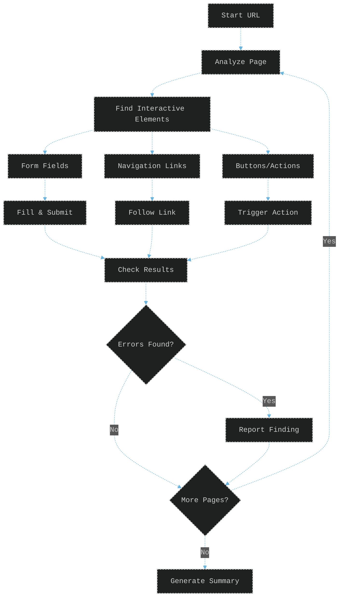
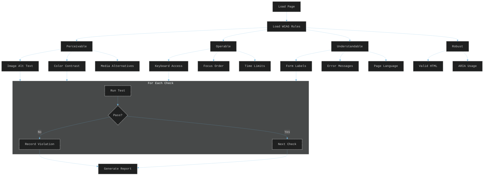
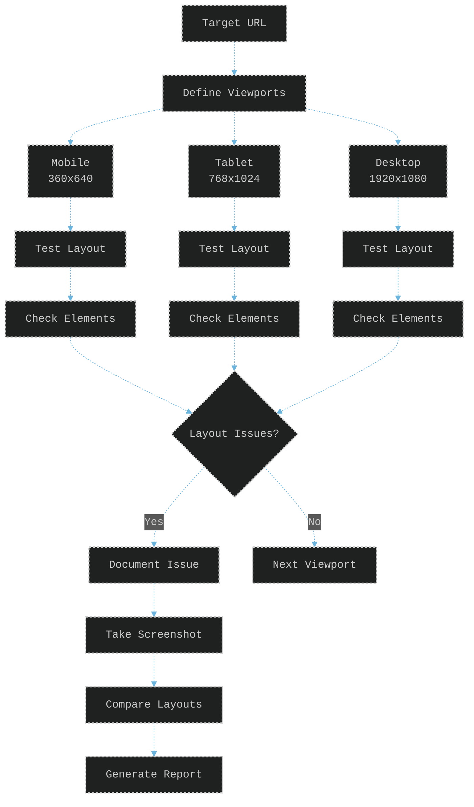
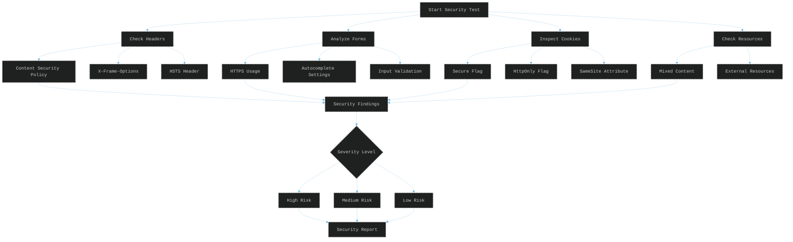
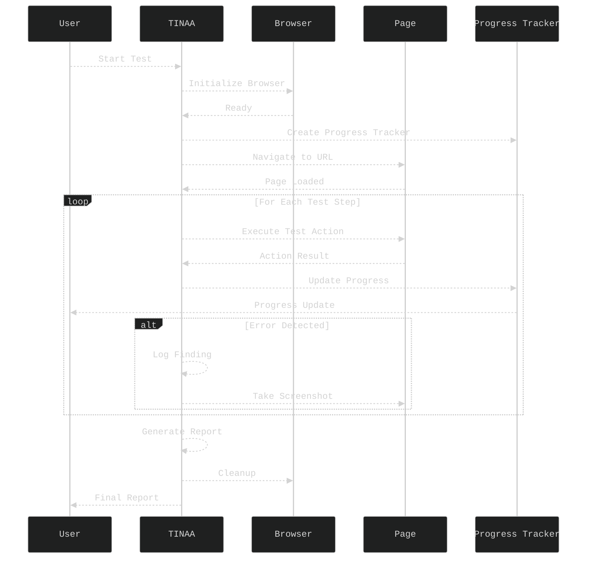

# TINAA Testing Guide

## Overview

TINAA provides comprehensive browser testing capabilities through multiple specialized test types. This guide covers how to use each testing mode effectively.

## Test Types

### 1. Exploratory Testing

Exploratory testing uses AI-driven heuristics to automatically explore and test web applications.



**Configuration** (from `resources/exploratory_heuristics.json`):
- Navigation patterns
- Form interaction strategies
- Error detection rules
- Element prioritization

**Example Usage:**
```python
# Via MCP
result = await run_exploratory_test(
    url="https://example.com",
    max_depth=3,
    max_pages=10,
    include_forms=True
)

# Via HTTP API
response = requests.post(
    "http://localhost:8765/test/exploratory",
    json={
        "url": "https://example.com",
        "max_depth": 3,
        "include_forms": True
    }
)
```

## 2. Accessibility Testing

Tests websites against WCAG (Web Content Accessibility Guidelines) standards.



**WCAG Standards Supported:**
- WCAG 2.1 Level A
- WCAG 2.1 Level AA
- WCAG 2.1 Level AAA

**Checked Elements** (from `resources/accessibility_rules.json`):
- Images without alt text
- Form inputs without labels
- Insufficient color contrast
- Missing ARIA attributes
- Keyboard navigation issues
- Screen reader compatibility

### 3. Responsive Design Testing

Tests how websites adapt to different screen sizes and devices.



**Default Viewports Tested:**
- Mobile: 360x640, 375x667, 414x896
- Tablet: 768x1024, 834x1194
- Desktop: 1366x768, 1920x1080

**Checks Performed:**
- Text readability
- Element overflow
- Navigation usability
- Image scaling
- Touch target sizes

### 4. Security Testing

Performs basic, non-invasive security checks.



**Security Checks** (from `resources/security_test_patterns.json`):
- HTTPS enforcement
- Security headers presence
- Cookie security flags
- Mixed content warnings
- Form security attributes
- Client-side validation
- Exposed sensitive data

### 5. Form Testing

Specialized testing for web forms and input validation.

**Form Test Strategies** (from `resources/form_test_strategies.json`):
- Field type detection
- Validation rule inference
- Boundary value testing
- Error message verification
- Submission flow testing

## Test Execution Flow



## Progress Tracking

All tests provide real-time progress updates through the `ProgressTracker` system:

```python
# Progress update structure
{
    "category": "exploratory_test",
    "phase": "navigation",
    "message": "Analyzing page: /products",
    "data": {
        "current_page": 3,
        "total_pages": 10,
        "findings_count": 2
    },
    "timestamp": "2024-01-01T00:00:00Z"
}
```

## Test Reports

All tests generate comprehensive reports containing:

1. **Summary Section**
   - Test duration
   - Pages/elements tested
   - Total findings
   - Overall status

2. **Findings Section**
   - Severity levels (high/medium/low/info)
   - Detailed descriptions
   - Affected elements
   - Recommendations

3. **Screenshots Section**
   - Visual evidence
   - Annotated problem areas
   - Before/after comparisons

4. **Technical Details**
   - Browser information
   - Test configuration
   - Resource timings

## Best Practices

### 1. Test Preparation
- Ensure target site is accessible
- Use test/staging environments
- Have test credentials ready
- Clear browser cache/cookies

### 2. Configuration
- Start with default settings
- Adjust depth/pages based on site size
- Enable specific checks as needed
- Use appropriate WCAG level

### 3. Interpreting Results
- Focus on high-severity findings first
- Verify findings manually
- Consider false positives
- Use screenshots for context

### 4. Performance
- Limit concurrent tests
- Use reasonable depth limits
- Monitor resource usage
- Cache test results

## Advanced Usage

### Custom Test Patterns

You can extend test capabilities by modifying resource files:

1. **Exploratory Heuristics** (`resources/exploratory_heuristics.json`)
   - Add custom element selectors
   - Define new interaction patterns
   - Specify error indicators

2. **Accessibility Rules** (`resources/accessibility_rules.json`)
   - Add custom WCAG checks
   - Modify severity levels
   - Define element exceptions

3. **Security Patterns** (`resources/security_test_patterns.json`)
   - Add vulnerability patterns
   - Define security indicators
   - Specify header requirements

### Playbook Execution

Create reusable test sequences:

```json
{
  "name": "E-commerce Checkout Flow",
  "steps": [
    {
      "action": "navigate",
      "url": "https://shop.example.com"
    },
    {
      "action": "click",
      "selector": ".add-to-cart"
    },
    {
      "action": "navigate",
      "url": "https://shop.example.com/cart"
    },
    {
      "action": "fill",
      "selector": "#email",
      "value": "test@example.com"
    },
    {
      "action": "click",
      "selector": ".checkout-button"
    }
  ]
}
```

### Integration with CI/CD

```yaml
# Example GitHub Actions workflow
name: TINAA Tests
on: [push]

jobs:
  test:
    runs-on: ubuntu-latest
    steps:
      - uses: actions/checkout@v2
      
      - name: Run TINAA Tests
        run: |
          docker run --rm \
            -v $PWD:/workspace \
            tinaa-playwright-msp:latest \
            python -c "
            import asyncio
            from app.main import run_accessibility_test
            
            async def test():
                result = await run_accessibility_test(
                    'https://staging.example.com',
                    'WCAG2.1-AA'
                )
                print(result)
            
            asyncio.run(test())
            "
```

## Troubleshooting

### Common Issues

1. **Browser Launch Failures**
   - Check Docker permissions
   - Verify Playwright installation
   - Ensure sufficient memory

2. **Timeout Errors**
   - Increase timeout values
   - Check network connectivity
   - Verify site responsiveness

3. **False Positives**
   - Review detection rules
   - Check element selectors
   - Validate against manual testing

4. **Performance Issues**
   - Reduce test depth
   - Limit concurrent operations
   - Monitor resource usage

### Debug Mode

Enable detailed logging:
```python
# In docker-compose.yml
environment:
  - LOG_LEVEL=DEBUG
```

Check logs:
```bash
docker logs tinaa-playwright-msp
tail -f logs/app_main.log
```