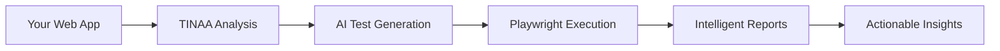

# TINAA User Guide
## Test Intelligence and Automation Advanced

*Your Complete Guide to Supercharging Playwright Testing with AI-Powered Automation*

---

## Table of Contents

1. [Quick Start](#quick-start)
2. [Core Concepts](#core-concepts)
3. [Installation & Setup](#installation--setup)
4. [Getting Started](#getting-started)
5. [Test Generation](#test-generation)
6. [Advanced Features](#advanced-features)
7. [Enterprise Integration](#enterprise-integration)
8. [Best Practices](#best-practices)
9. [Troubleshooting](#troubleshooting)
10. [Reference](#reference)

---

## Quick Start

### What is TINAA?

TINAA (Test Intelligence and Automation Advanced) is an AI-powered Playwright testing platform that transforms how you create, maintain, and scale browser automation tests. Instead of writing complex test code from scratch, TINAA generates intelligent tests, provides real-time guidance, and automates tedious testing tasks.

### 5-Minute Setup

```bash
# 1. Clone and start TINAA
git clone https://github.com/aj-geddes/tinaa-playwright-msp.git
cd tinaa-playwright-msp
docker-compose up -d

# 2. Verify it's running
curl http://localhost:8765/health

# 3. Generate your first test
curl -X POST http://localhost:8765/test/exploratory \
  -H "Content-Type: application/json" \
  -d '{"action": "exploratory", "parameters": {"url": "https://your-app.com"}}'
```

**That's it!** TINAA is now analyzing your application and generating comprehensive test insights.

---

## Core Concepts

### The TINAA Advantage

Traditional Playwright testing requires you to:
- ❌ Write selectors manually
- ❌ Create test scenarios from scratch  
- ❌ Debug flaky tests alone
- ❌ Maintain complex test suites

With TINAA, you get:
- ✅ **AI-Generated Selectors**: Intelligent, stable element targeting
- ✅ **Automated Test Creation**: Generate tests from URLs or requirements
- ✅ **Smart Debugging**: AI-powered error analysis and fixes
- ✅ **Comprehensive Coverage**: Accessibility, security, and responsive testing built-in

### How TINAA Works



1. **Analyze**: TINAA examines your application structure
2. **Generate**: AI creates comprehensive test scenarios
3. **Execute**: Playwright runs tests with real browser automation
4. **Report**: Detailed insights with screenshots and recommendations
5. **Improve**: Continuous learning improves test quality

### Key Components

| Component | Purpose | Benefits |
|-----------|---------|----------|
| **MCP Server** | Core AI engine | Intelligent test generation |
| **HTTP API** | REST interface | Easy integration |
| **Resource Framework** | 25+ testing tools | Accelerated development |
| **LSP Server** | IDE integration | Real-time assistance |

---

## Installation & Setup

### System Requirements

- **Docker** (recommended) or Python 3.8+
- **4GB RAM** minimum, 8GB recommended
- **2GB disk space** for browser dependencies
- **Network access** for browser downloads

### Installation Options

#### Option 1: Docker (Recommended)

**Advantages**: No dependency management, works everywhere, enterprise-ready

```bash
# Clone repository
git clone https://github.com/aj-geddes/tinaa-playwright-msp.git
cd tinaa-playwright-msp

# Start TINAA with all services
docker-compose up -d

# Verify installation
docker ps
curl http://localhost:8765/health
```

#### Option 2: Local Python Installation

**Advantages**: Direct access to source, customizable

```bash
# Clone repository
git clone https://github.com/aj-geddes/tinaa-playwright-msp.git
cd tinaa-playwright-msp

# Install dependencies
pip install -r requirements.txt

# Install Playwright browsers
playwright install chromium

# Start TINAA
python app/http_server.py
```

#### Option 3: Claude Desktop Integration

**Advantages**: Direct AI assistant integration

Add to Claude Desktop settings:
```json
{
  "mcpServers": {
    "tinaa-playwright": {
      "command": "docker",
      "args": ["run", "--rm", "-i", "tinaa-playwright-msp:latest"]
    }
  }
}
```

### Environment Configuration

Create `.env` file for custom settings:
```bash
# TINAA Configuration
TINAA_MODE=http                    # 'http' or 'mcp'
PLAYWRIGHT_BROWSERS_PATH=/browsers # Browser location
LOG_LEVEL=INFO                     # DEBUG, INFO, WARNING, ERROR
MAX_CONCURRENT_TESTS=3             # Parallel test limit
DEFAULT_TIMEOUT=30000              # Default timeout (ms)
SCREENSHOT_ON_FAILURE=true         # Auto-capture on errors
```

---

## Getting Started

### Your First Test

Let's create a comprehensive test for a web application in under 2 minutes:

#### Step 1: Start Basic Analysis

```bash
curl -X POST http://localhost:8765/test/connectivity
# Response: {"success": true, "result": "Browser started successfully."}
```

#### Step 2: Navigate to Your App

```bash
curl -X POST http://localhost:8765/navigate \
  -H "Content-Type: application/json" \
  -d '{"action": "navigate", "parameters": {"url": "https://your-app.com"}}'
```

#### Step 3: Generate Exploratory Tests

```bash
curl -X POST http://localhost:8765/test/exploratory \
  -H "Content-Type: application/json" \
  -d '{
    "action": "exploratory", 
    "parameters": {
      "url": "https://your-app.com",
      "focus_area": "login"
    }
  }'
```

**Result**: TINAA will automatically:
- Discover all interactive elements
- Generate test scenarios for login flows
- Identify potential accessibility issues
- Create maintainable test code
- Provide actionable recommendations

#### Step 4: Run Accessibility Audit

```bash
curl -X POST http://localhost:8765/test/accessibility \
  -H "Content-Type: application/json" \
  -d '{"action": "accessibility", "parameters": {}}'
```

### Understanding Test Results

TINAA provides comprehensive results in JSON format:

```json
{
  "success": true,
  "result": {
    "url": "https://your-app.com",
    "test_scenarios": [
      {
        "name": "Login Flow Test",
        "steps": ["Navigate to login", "Fill credentials", "Submit form"],
        "selectors": {
          "username": "data-testid=username",
          "password": "data-testid=password",
          "submit": "button[type=submit]"
        },
        "generated_code": "// Playwright test code here"
      }
    ],
    "accessibility_findings": [
      {
        "severity": "warning",
        "rule": "color-contrast",
        "message": "Text contrast ratio insufficient",
        "element": ".login-button",
        "recommendation": "Increase contrast to 4.5:1 minimum"
      }
    ],
    "screenshots": ["base64-encoded-screenshot-data"]
  }
}
```

### Using Generated Code

TINAA generates production-ready Playwright code:

```javascript
// Generated by TINAA - Login Flow Test
import { test, expect } from '@playwright/test';

test('Login Flow Test', async ({ page }) => {
  // Navigate to login page
  await page.goto('https://your-app.com/login');
  
  // Fill login credentials
  await page.locator('[data-testid=username]').fill('testuser');
  await page.locator('[data-testid=password]').fill('password123');
  
  // Submit form
  await page.locator('button[type=submit]').click();
  
  // Verify successful login
  await expect(page).toHaveURL(/.*dashboard/);
  await expect(page.locator('[data-testid=welcome]')).toBeVisible();
});
```

---

## Test Generation

### AI-Powered Test Creation

TINAA's AI understands your application and generates intelligent tests automatically.

#### Exploratory Test Generation

**Use Case**: Discover all testable functionality without prior knowledge

```bash
curl -X POST http://localhost:8765/test/exploratory \
  -H "Content-Type: application/json" \
  -d '{
    "action": "exploratory",
    "parameters": {
      "url": "https://your-app.com",
      "focus_area": "general",
      "max_depth": 3,
      "include_forms": true,
      "check_accessibility": true
    }
  }'
```

**TINAA analyzes**:
- Page structure and navigation
- Interactive elements (buttons, forms, links)
- User workflows and paths
- Potential error scenarios
- Accessibility compliance

**Generates**:
- Complete test scenarios
- Stable selectors using best practices
- Edge case handling
- Error validation tests
- Performance benchmarks

#### Requirements-Based Generation

**Use Case**: Generate tests from written requirements

```python
import requests

# Define your requirements
requirements = """
User Story: As a customer, I want to add items to my shopping cart
Acceptance Criteria:
- User can search for products
- User can view product details
- User can add products to cart
- Cart shows correct item count
- User can proceed to checkout
"""

# Generate tests from requirements
response = requests.get("http://localhost:8765/resources/prompts/test-generator.json")
prompt_template = response.json()["content"]["prompts"]["generate_from_requirements"]

# Use the prompt with your AI assistant or automation
```

#### Form-Specific Test Generation

**Use Case**: Comprehensive form testing

```bash
curl -X POST http://localhost:8765/detect_forms \
  -H "Content-Type: application/json" \
  -d '{"action": "detect_forms", "parameters": {}}'
```

**TINAA automatically**:
- Identifies all form fields
- Generates validation tests
- Creates boundary value tests
- Tests error handling
- Validates accessibility

### Smart Selector Generation

TINAA generates selectors following best practices:

**Priority Order**:
1. `data-testid` attributes (most stable)
2. `aria-label` and role attributes (accessible)
3. Unique text content (semantic)
4. CSS selectors (fallback)

**Example Generated Selectors**:
```javascript
// TINAA-generated selectors with fallbacks
const selectors = {
  loginButton: [
    '[data-testid="login-button"]',
    'button[aria-label="Log in"]',
    'button:has-text("Log in")',
    '.login-form button[type="submit"]'
  ]
};
```

### Test Scenario Templates

TINAA includes 25+ pre-built test scenarios:

#### E-commerce Testing
```javascript
// Generated shopping cart test
test('Shopping Cart Workflow', async ({ page }) => {
  await page.goto('/products');
  
  // Add items to cart
  await page.locator('[data-testid="product-1"] .add-to-cart').click();
  await expect(page.locator('[data-testid="cart-count"]')).toHaveText('1');
  
  // View cart
  await page.locator('[data-testid="cart-link"]').click();
  await expect(page.locator('[data-testid="cart-items"]')).toBeVisible();
  
  // Proceed to checkout
  await page.locator('[data-testid="checkout-button"]').click();
  await expect(page).toHaveURL(/.*checkout/);
});
```

#### Authentication Testing
```javascript
// Generated login test with error handling
test('Login with Invalid Credentials', async ({ page }) => {
  await page.goto('/login');
  
  // Attempt login with invalid credentials
  await page.locator('[data-testid="username"]').fill('invalid@email.com');
  await page.locator('[data-testid="password"]').fill('wrongpassword');
  await page.locator('[data-testid="submit"]').click();
  
  // Verify error message
  await expect(page.locator('[data-testid="error-message"]'))
    .toHaveText('Invalid username or password');
  
  // Verify user stays on login page
  await expect(page).toHaveURL(/.*login/);
});
```

---

## Advanced Features

### Playbook Execution

Create complex test workflows with TINAA's playbook system:

```json
{
  "name": "Complete User Journey",
  "client_id": "test-session-001",
  "steps": [
    {
      "id": "navigate",
      "action": "navigate",
      "parameters": {"url": "https://your-app.com"},
      "description": "Load home page"
    },
    {
      "id": "search",
      "action": "fill_form",
      "parameters": {
        "fields": {
          "[data-testid='search']": "laptop"
        }
      },
      "description": "Search for products"
    },
    {
      "id": "screenshot",
      "action": "screenshot",
      "parameters": {"full_page": true},
      "description": "Capture search results"
    },
    {
      "id": "accessibility",
      "action": "test_accessibility",
      "parameters": {},
      "description": "Check WCAG compliance"
    }
  ]
}
```

Execute the playbook:
```bash
curl -X POST http://localhost:8765/playbook/execute \
  -H "Content-Type: application/json" \
  -d @complete-journey-playbook.json
```

### Real-Time Progress Tracking

Monitor test execution with WebSocket integration:

```javascript
// Connect to real-time updates
const ws = new WebSocket('ws://localhost:8765/ws/client-123');

ws.onmessage = (event) => {
  const update = JSON.parse(event.data);
  
  if (update.type === 'progress') {
    console.log(`Step ${update.data.step}: ${update.data.status}`);
    updateProgressBar(update.data.progress);
  }
  
  if (update.type === 'result') {
    displayResults(update.result);
  }
};

// Execute test with real-time feedback
ws.send(JSON.stringify({
  type: 'execute',
  action: 'test_exploratory',
  parameters: { url: 'https://your-app.com' }
}));
```

### Visual Regression Testing

TINAA automatically captures screenshots and compares them:

```bash
# Take baseline screenshots
curl -X POST http://localhost:8765/screenshot \
  -H "Content-Type: application/json" \
  -d '{"action": "screenshot", "parameters": {"full_page": true}}'

# Run visual comparison test
curl -X POST http://localhost:8765/test/visual \
  -H "Content-Type: application/json" \
  -d '{
    "action": "visual_regression",
    "parameters": {
      "baseline_url": "https://staging.your-app.com",
      "comparison_url": "https://your-app.com",
      "threshold": 0.1
    }
  }'
```

### Multi-Device Testing

Test responsive designs across devices:

```json
{
  "name": "Responsive Design Test",
  "steps": [
    {
      "action": "test_responsive",
      "parameters": {
        "url": "https://your-app.com",
        "devices": [
          {"name": "Desktop", "width": 1920, "height": 1080},
          {"name": "Tablet", "width": 768, "height": 1024},
          {"name": "Mobile", "width": 375, "height": 667}
        ]
      }
    }
  ]
}
```

### Security Testing

Automated security vulnerability scanning:

```bash
curl -X POST http://localhost:8765/test/security \
  -H "Content-Type: application/json" \
  -d '{
    "action": "security_scan",
    "parameters": {
      "url": "https://your-app.com",
      "checks": [
        "csrf_protection",
        "xss_vulnerability", 
        "sql_injection",
        "sensitive_data_exposure"
      ]
    }
  }'
```

---

## Enterprise Integration

### CI/CD Pipeline Integration

#### GitHub Actions

```yaml
# .github/workflows/tinaa-tests.yml
name: TINAA Automated Testing

on:
  push:
    branches: [main, develop]
  pull_request:
    branches: [main]

jobs:
  tinaa-tests:
    runs-on: ubuntu-latest
    
    steps:
    - uses: actions/checkout@v3
    
    - name: Start TINAA
      run: |
        docker run -d --name tinaa \
          -p 8765:8765 \
          -e TINAA_MODE=http \
          tinaa-playwright-msp:latest
    
    - name: Wait for TINAA
      run: |
        timeout 60s bash -c 'until curl -s http://localhost:8765/health; do sleep 1; done'
    
    - name: Run Exploratory Tests
      run: |
        curl -X POST http://localhost:8765/test/exploratory \
          -H "Content-Type: application/json" \
          -d '{
            "action": "exploratory",
            "parameters": {
              "url": "${{ env.STAGING_URL }}",
              "focus_area": "critical_paths"
            }
          }' > exploratory-results.json
    
    - name: Run Accessibility Tests
      run: |
        curl -X POST http://localhost:8765/test/accessibility \
          -H "Content-Type: application/json" \
          -d '{"action": "accessibility", "parameters": {}}' \
          > accessibility-results.json
    
    - name: Upload Test Results
      uses: actions/upload-artifact@v3
      with:
        name: tinaa-test-results
        path: |
          exploratory-results.json
          accessibility-results.json
```

#### Jenkins Pipeline

```groovy
pipeline {
    agent any
    
    environment {
        TINAA_URL = 'http://localhost:8765'
    }
    
    stages {
        stage('Start TINAA') {
            steps {
                sh '''
                    docker run -d --name tinaa-${BUILD_NUMBER} \
                      -p 8765:8765 \
                      tinaa-playwright-msp:latest
                '''
            }
        }
        
        stage('Health Check') {
            steps {
                sh '''
                    timeout 60 bash -c 'until curl -s ${TINAA_URL}/health; do sleep 1; done'
                '''
            }
        }
        
        stage('Generate Tests') {
            parallel {
                stage('Exploratory Testing') {
                    steps {
                        sh '''
                            curl -X POST ${TINAA_URL}/test/exploratory \
                              -H "Content-Type: application/json" \
                              -d "{\\"action\\": \\"exploratory\\", \\"parameters\\": {\\"url\\": \\"${STAGING_URL}\\"}}" \
                              > exploratory-results.json
                        '''
                    }
                }
                
                stage('Accessibility Testing') {
                    steps {
                        sh '''
                            curl -X POST ${TINAA_URL}/test/accessibility \
                              -H "Content-Type: application/json" \
                              -d "{\\"action\\": \\"accessibility\\", \\"parameters\\": {}}" \
                              > accessibility-results.json
                        '''
                    }
                }
            }
        }
        
        stage('Process Results') {
            steps {
                publishHTML([
                    allowMissing: false,
                    alwaysLinkToLastBuild: true,
                    keepAll: true,
                    reportDir: '.',
                    reportFiles: '*-results.json',
                    reportName: 'TINAA Test Report'
                ])
            }
        }
    }
    
    post {
        always {
            sh 'docker stop tinaa-${BUILD_NUMBER} && docker rm tinaa-${BUILD_NUMBER}'
        }
    }
}
```

### IDE Integration

#### VS Code Extension

Create `.vscode/tasks.json`:
```json
{
    "version": "2.0.0",
    "tasks": [
        {
            "label": "TINAA: Generate Tests",
            "type": "shell",
            "command": "curl",
            "args": [
                "-X", "POST",
                "http://localhost:8765/test/exploratory",
                "-H", "Content-Type: application/json",
                "-d", "{\"action\": \"exploratory\", \"parameters\": {\"url\": \"${input:targetUrl}\"}}"
            ],
            "group": "test",
            "presentation": {
                "echo": true,
                "reveal": "always",
                "focus": false,
                "panel": "shared"
            }
        }
    ],
    "inputs": [
        {
            "id": "targetUrl",
            "description": "Target URL for testing",
            "default": "http://localhost:3000",
            "type": "promptString"
        }
    ]
}
```

#### JetBrains Integration

Create external tool in IntelliJ/WebStorm:
- **Name**: TINAA Test Generator
- **Program**: `curl`
- **Arguments**: `-X POST http://localhost:8765/test/exploratory -H "Content-Type: application/json" -d '{"action": "exploratory", "parameters": {"url": "$Prompt$"}}'`
- **Working Directory**: `$ProjectFileDir$`

### Team Collaboration

#### Shared Test Repository

```bash
# Create shared test configurations
mkdir tinaa-configs
cd tinaa-configs

# Team playbooks
cat > team-smoke-tests.json << EOF
{
  "name": "Team Smoke Tests",
  "description": "Critical path validation for all features",
  "steps": [
    {"action": "navigate", "parameters": {"url": "https://app.company.com"}},
    {"action": "test_accessibility", "parameters": {}},
    {"action": "test_responsive", "parameters": {}},
    {"action": "screenshot", "parameters": {"full_page": true}}
  ]
}
EOF

# Share via git
git init
git add .
git commit -m "Add team TINAA configurations"
git remote add origin https://github.com/company/tinaa-configs.git
git push -u origin main
```

#### Test Result Dashboard

Create a simple dashboard for team visibility:

```html
<!DOCTYPE html>
<html>
<head>
    <title>TINAA Test Dashboard</title>
    <script src="https://cdn.jsdelivr.net/npm/chart.js"></script>
</head>
<body>
    <h1>TINAA Test Results Dashboard</h1>
    
    <div id="test-status">
        <canvas id="statusChart"></canvas>
    </div>
    
    <script>
        // Fetch latest test results
        fetch('http://localhost:8765/api/test-results/latest')
            .then(response => response.json())
            .then(data => {
                const ctx = document.getElementById('statusChart').getContext('2d');
                new Chart(ctx, {
                    type: 'doughnut',
                    data: {
                        labels: ['Passed', 'Failed', 'Warnings'],
                        datasets: [{
                            data: [data.passed, data.failed, data.warnings],
                            backgroundColor: ['#4CAF50', '#F44336', '#FF9800']
                        }]
                    }
                });
            });
    </script>
</body>
</html>
```

---

## Best Practices

### Test Organization

#### Project Structure
```
your-project/
├── tests/
│   ├── tinaa-generated/      # AI-generated tests
│   │   ├── exploratory/
│   │   ├── accessibility/
│   │   └── security/
│   ├── custom/              # Hand-written tests  
│   └── shared/              # Shared utilities
├── tinaa-configs/           # TINAA configurations
│   ├── playbooks/
│   ├── resources/
│   └── templates/
└── test-results/           # Generated reports
    ├── screenshots/
    ├── traces/
    └── reports/
```

#### Naming Conventions
```javascript
// Generated test files
test.describe('TINAA Generated - Login Flow', () => {
  test('should login with valid credentials', async ({ page }) => {
    // Test implementation
  });
  
  test('should show error for invalid credentials', async ({ page }) => {
    // Test implementation  
  });
});

// Custom test files
test.describe('Custom - Advanced User Scenarios', () => {
  test('should handle complex workflow', async ({ page }) => {
    // Custom test logic
  });
});
```

### Selector Strategy

#### Use TINAA's Selector Hierarchy
1. **Data Test IDs** (Recommended)
   ```html
   <button data-testid="submit-button">Submit</button>
   ```
   ```javascript
   await page.locator('[data-testid="submit-button"]').click();
   ```

2. **Accessibility Attributes**
   ```html
   <button aria-label="Submit form">Submit</button>
   ```
   ```javascript
   await page.locator('[aria-label="Submit form"]').click();
   ```

3. **Semantic Selectors**
   ```javascript
   await page.locator('button:has-text("Submit")').click();
   ```

#### Avoid Fragile Selectors
```javascript
// ❌ Fragile - breaks with style changes
await page.locator('.btn.btn-primary.submit-btn').click();

// ✅ Stable - TINAA recommended
await page.locator('[data-testid="submit-button"]').click();
```

### Performance Optimization

#### Parallel Test Execution
```javascript
// Configure parallel execution
test.describe.configure({ mode: 'parallel' });

test.describe('TINAA Generated Tests', () => {
  test('homepage accessibility', async ({ page }) => {
    // Fast accessibility check
  });
  
  test('login flow validation', async ({ page }) => {
    // Independent login test
  });
  
  test('search functionality', async ({ page }) => {
    // Isolated search test  
  });
});
```

#### Resource Management
```javascript
// Efficient resource usage
test.beforeEach(async ({ page }) => {
  // Set default timeout
  page.setDefaultTimeout(30000);
  
  // Configure performance monitoring
  await page.route('**/*', route => {
    if (route.request().resourceType() === 'image') {
      route.abort(); // Skip images for faster tests
    } else {
      route.continue();
    }
  });
});
```

### Maintenance Guidelines

#### Regular Test Updates
```bash
# Weekly test refresh
curl -X POST http://localhost:8765/test/exploratory \
  -d '{"action": "exploratory", "parameters": {"url": "https://your-app.com", "refresh_baseline": true}}'

# Update accessibility standards
curl -X POST http://localhost:8765/test/accessibility \
  -d '{"action": "accessibility", "parameters": {"standard": "WCAG2.2-AA"}}'
```

#### Version Control Integration
```bash
# Track TINAA configurations
git add tinaa-configs/
git commit -m "Update TINAA test configurations"

# Branch-specific test generation
git checkout feature/new-login
curl -X POST http://localhost:8765/test/exploratory \
  -d '{"action": "exploratory", "parameters": {"url": "https://staging-new-login.your-app.com"}}'
```

---

## Troubleshooting

### Common Issues and Solutions

#### 1. Browser Connection Failed

**Symptoms**:
```json
{"error": "Browser failed to connect", "code": "BROWSER_ERROR"}
```

**Solutions**:
```bash
# Check Docker container status
docker ps
docker logs tinaa-container

# Restart TINAA with verbose logging
docker run -e LOG_LEVEL=DEBUG tinaa-playwright-msp

# Test browser installation
docker exec -it tinaa-container playwright install --dry-run
```

#### 2. Selector Not Found

**Symptoms**:
```json
{"error": "Element not found: [data-testid='submit']", "code": "SELECTOR_ERROR"}
```

**Solutions**:
```bash
# Regenerate selectors with current page
curl -X POST http://localhost:8765/analyze_selectors \
  -d '{"url": "https://your-app.com"}'

# Use TINAA's selector debugging
curl -X POST http://localhost:8765/debug/selectors \
  -d '{"selector": "[data-testid=submit]", "url": "https://your-app.com"}'
```

#### 3. Timeout Errors

**Symptoms**:
```json
{"error": "Test timeout after 30000ms", "code": "TIMEOUT_ERROR"}
```

**Solutions**:
```bash
# Increase timeout for slow pages
curl -X POST http://localhost:8765/configure \
  -d '{"default_timeout": 60000}'

# Use TINAA's performance analysis
curl -X POST http://localhost:8765/test/performance \
  -d '{"url": "https://your-app.com"}'
```

#### 4. Memory Issues

**Symptoms**:
```json
{"error": "Out of memory", "code": "MEMORY_ERROR"}
```

**Solutions**:
```bash
# Increase Docker memory
docker run -m 4g tinaa-playwright-msp

# Enable memory optimization
curl -X POST http://localhost:8765/configure \
  -d '{"memory_optimization": true, "max_concurrent_tests": 1}'
```

### Debug Mode

Enable comprehensive debugging:

```bash
# Start TINAA with debug mode
docker run -e LOG_LEVEL=DEBUG -e PLAYWRIGHT_DEBUG=1 tinaa-playwright-msp

# Generate debug trace
curl -X POST http://localhost:8765/test/exploratory \
  -d '{"action": "exploratory", "parameters": {"url": "https://your-app.com", "debug": true}}'
```

### Performance Monitoring

Monitor TINAA performance:

```bash
# Check system resources
curl http://localhost:8765/system/stats

# Monitor test execution
curl http://localhost:8765/test/metrics

# View detailed traces
curl http://localhost:8765/traces/latest
```

### Getting Help

#### Community Resources
- **GitHub Issues**: [Report bugs and request features](https://github.com/aj-geddes/tinaa-playwright-msp/issues)
- **Discussions**: [Community Q&A and best practices](https://github.com/aj-geddes/tinaa-playwright-msp/discussions)
- **Documentation**: [Complete API reference](docs/API.md)

#### Enterprise Support
- **Priority Support**: Contact enterprise@tinaa.dev
- **Custom Integration**: Professional services available
- **Training Programs**: Team onboarding and advanced workshops

---

## Reference

### Quick Reference Commands

#### Essential Operations
```bash
# Health check
curl http://localhost:8765/health

# Navigate to page
curl -X POST http://localhost:8765/navigate -d '{"url": "URL"}'

# Generate exploratory tests
curl -X POST http://localhost:8765/test/exploratory -d '{"parameters": {"url": "URL"}}'

# Run accessibility audit
curl -X POST http://localhost:8765/test/accessibility -d '{}'

# Take screenshot
curl -X POST http://localhost:8765/screenshot -d '{"parameters": {"full_page": true}}'
```

#### Advanced Operations
```bash
# Execute playbook
curl -X POST http://localhost:8765/playbook/execute -d @playbook.json

# Security scan
curl -X POST http://localhost:8765/test/security -d '{"parameters": {"url": "URL"}}'

# Visual regression test
curl -X POST http://localhost:8765/test/visual -d '{"parameters": {"baseline": "URL1", "comparison": "URL2"}}'
```

### Environment Variables

| Variable | Default | Description |
|----------|---------|-------------|
| `TINAA_MODE` | `http` | Operation mode: `http` or `mcp` |
| `LOG_LEVEL` | `INFO` | Logging level: `DEBUG`, `INFO`, `WARNING`, `ERROR` |
| `DEFAULT_TIMEOUT` | `30000` | Default timeout in milliseconds |
| `MAX_CONCURRENT_TESTS` | `3` | Maximum parallel test execution |
| `SCREENSHOT_ON_FAILURE` | `true` | Auto-capture screenshots on test failures |
| `BROWSER_PATH` | `/ms-playwright` | Playwright browser installation path |

### Resource Library

TINAA includes 25+ specialized resources:

#### Tools (9 resources)
- CLI installation and runners
- Project scaffolding generators  
- CI/CD integration templates
- Visual testing configurations
- Debugging utilities
- State management tools

#### Quickstarts (4 resources)
- Web application testing
- Mobile device emulation
- API testing patterns
- Hybrid testing approaches

#### Examples (4 resources)
- Authentication flows
- CRUD operations
- E-commerce workflows
- Dashboard testing

#### Documentation (3 resources)
- Best practices guide
- Troubleshooting manual
- Design patterns reference

#### AI Prompts (3 resources)
- Test generation prompts
- Code review automation
- Debug assistance templates

### API Endpoints Summary

| Method | Endpoint | Purpose |
|--------|----------|---------|
| GET | `/health` | System health check |
| POST | `/navigate` | Browser navigation |
| POST | `/screenshot` | Capture screenshots |
| POST | `/test/exploratory` | Generate comprehensive tests |
| POST | `/test/accessibility` | WCAG compliance audit |
| POST | `/test/security` | Security vulnerability scan |
| POST | `/test/responsive` | Multi-device testing |
| POST | `/playbook/execute` | Run test sequences |
| WS | `/ws/{client_id}` | Real-time communication |

---

*This guide represents the complete TINAA user experience. For the latest updates and advanced features, visit the [official documentation](docs/).*

**Ready to supercharge your Playwright testing?** Start with the [Quick Start](#quick-start) section and begin generating intelligent tests in minutes!