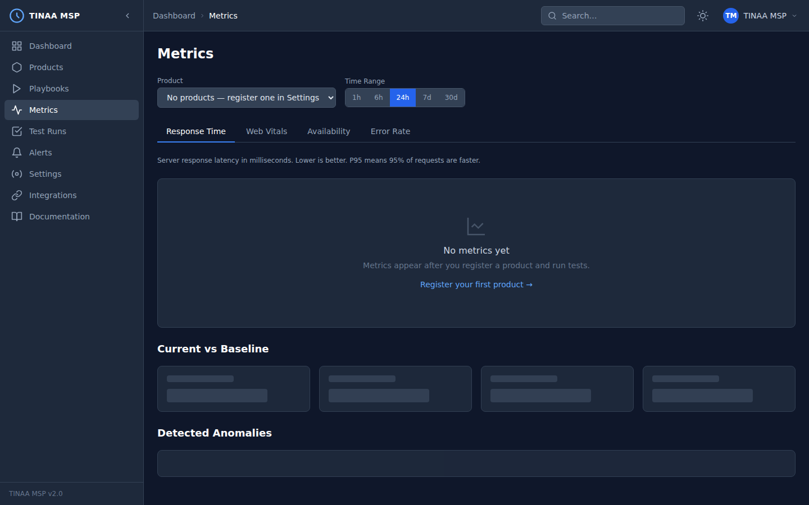

# APM and Metrics

TINAA MSP includes a built-in Application Performance Monitoring layer that captures response times, Web Vitals, availability, and error rates for every registered endpoint. APM data feeds directly into the [Performance component of the quality score](quality-scores.md) and powers the metrics dashboard.



---

## Overview

Every environment and endpoint registered in TINAA is monitored continuously using synthetic checks — automated requests that TINAA sends from its own infrastructure to measure your application from the outside in. When a playbook runs, TINAA also instruments the browser to capture real Web Vitals data from a rendered page.

APM data is stored as time-series records in TimescaleDB (PostgreSQL), enabling efficient range queries and automatic data compression for long-term retention.

---

## Metric Types

### Response Time

End-to-end latency from first byte sent to last byte received, measured by TINAA's synthetic monitor.

Reported as:
- `p50_ms` — median (50th percentile)
- `p90_ms` — 90th percentile
- `p95_ms` — 95th percentile
- `p99_ms` — 99th percentile

The performance budget comparison uses `p95_ms` against the endpoint's configured `performance_budget_ms` (default: 500 ms).

### Web Vitals

Core Web Vitals captured during playbook runs using JavaScript `PerformanceObserver` injection. TINAA collects five metrics per page load:

| Metric | Full name | Measures |
|---|---|---|
| LCP | Largest Contentful Paint | Load performance — time until the largest visible element renders |
| FCP | First Contentful Paint | Time until the first text or image renders |
| CLS | Cumulative Layout Shift | Visual stability — how much layout shifts unexpectedly |
| INP | Interaction to Next Paint | Responsiveness — delay between user interaction and visual response |
| TTFB | Time to First Byte | Server response speed — time from request to first byte received |

### Availability

Percentage of synthetic checks that returned a successful HTTP response (2xx) over the selected time window.

```
Availability = successful_checks / total_checks × 100
```

TINAA runs availability checks on the schedule configured per environment (default: every 5 minutes for production, every 15 minutes for staging).

### Error Rate

Percentage of requests returning 4xx or 5xx HTTP status codes.

```
Error Rate = error_responses / total_responses × 100
```

---

## Web Vitals Thresholds

Google publishes thresholds for each Core Web Vital. TINAA uses these thresholds to rate your metrics and flag regressions.

| Metric | Good | Needs Improvement | Poor |
|---|---|---|---|
| LCP | < 2,500 ms | 2,500 – 4,000 ms | > 4,000 ms |
| FCP | < 1,800 ms | 1,800 – 3,000 ms | > 3,000 ms |
| CLS | < 0.10 | 0.10 – 0.25 | > 0.25 |
| INP | < 200 ms | 200 – 500 ms | > 500 ms |
| TTFB | < 800 ms | 800 – 1,800 ms | > 1,800 ms |

The **overall rating** for a page is the worst rating across all measured metrics. A page rated "good" for LCP and FCP but "needs improvement" for CLS gets an overall rating of "needs improvement".

---

## Synthetic Monitoring

Synthetic monitoring means TINAA itself makes HTTP requests to your endpoints on a schedule, independent of real user traffic. This provides:

- **Zero-traffic baselines** — you see availability data even at 3am
- **Consistent measurement conditions** — not affected by user location or network
- **Alert trigger** — anomalies are detected and alerted on without waiting for users to notice

Each synthetic check:

1. Makes an HTTP GET to the endpoint URL
2. Records response time, status code, and response size
3. Compares the result to the stored baseline
4. If the response time exceeds `baseline_p95 × 1.2`, the check is flagged as anomalous
5. If the status code is not in the expected range, the endpoint is marked as unavailable

Configure the monitoring interval in the environment settings:

```bash
PATCH /api/v1/products/{product_id}/environments/{environment_id}
Content-Type: application/json

{
  "monitoring_interval_seconds": 60
}
```

---

## Baseline Establishment

A baseline is computed from the first 30 data points collected for a metric (configurable). The baseline captures:

- `p50` — median value
- `p90` — 90th percentile
- `p99` — 99th percentile
- `mean` — arithmetic mean

Once established, the baseline updates as a rolling average. TINAA requires at least 30 samples before the baseline is considered stable. During this warmup period, anomaly detection is disabled.

The baseline is shown in the metrics dashboard as a reference line alongside the current time-series data.

---

## Anomaly Detection

TINAA flags a metric value as anomalous when it exceeds the 95th percentile of the baseline by more than 20%:

```
anomaly_threshold = baseline_p95 × 1.20
is_anomalous = current_value > anomaly_threshold
```

Anomalous data points are:

- Highlighted on the metrics chart in the dashboard
- Included in alert evaluations for the "High Response Time" rule
- Flagged in the quality report under `top_issues`

Anomaly detection applies to response time, LCP, and FCP metrics. CLS and error rate use fixed absolute thresholds.

---

## Time Range Selection

The metrics dashboard supports the following time ranges:

| Range | Description | Data resolution |
|---|---|---|
| 1h | Last 1 hour | 1-minute buckets |
| 6h | Last 6 hours | 5-minute buckets |
| 24h | Last 24 hours | 15-minute buckets |
| 7d | Last 7 days | 1-hour buckets |
| 30d | Last 30 days | 6-hour buckets |

Use the time range selector in the top-right of the metrics dashboard to switch between views.

---

## Current vs. Baseline Comparison

The metrics dashboard shows two lines for each time-series metric:

- **Current** — real-time data from the selected time range
- **Baseline** — P50/P95 baseline computed from historical data

A table below the chart shows the current average, the baseline, and the delta:

| Metric | Current | Baseline P50 | Baseline P95 | Delta |
|---|---|---|---|---|
| Response time | 340 ms | 220 ms | 450 ms | +120 ms |
| LCP | 2,100 ms | 1,900 ms | 2,500 ms | +200 ms |
| Availability | 99.95% | 99.9% | — | +0.05% |

If `current > baseline_p95 × 1.2`, the delta cell is highlighted in red.

---

## Accessing Metrics via the API

```bash
# Get time-series metrics for a product (defaults: 24h, all metric types)
GET /api/v1/products/{product_id}/metrics

# Filter by metric type and time window
GET /api/v1/products/{product_id}/metrics?metric_type=response_time&hours=6

# Metrics for a specific endpoint
GET /api/v1/endpoints/{endpoint_id}/metrics?hours=24
```

**Query parameters:**

| Parameter | Type | Default | Description |
|---|---|---|---|
| `hours` | integer | 24 | Lookback window in hours |
| `metric_type` | string | (all) | One of: `response_time`, `lcp`, `fcp`, `cls`, `inp`, `ttfb`, `availability`, `error_rate` |

**Example response:**

```json
{
  "product_id": "checkout-service",
  "metric_type": "response_time",
  "hours": 24,
  "metrics": [
    { "timestamp": "2026-03-23T09:00:00Z", "value": 312 },
    { "timestamp": "2026-03-23T10:00:00Z", "value": 298 },
    { "timestamp": "2026-03-23T11:00:00Z", "value": 340 }
  ],
  "baseline": {
    "p50": 220.0,
    "p90": 380.0,
    "p95": 450.0,
    "mean": 235.0
  },
  "current_avg": 316.7,
  "trend": "stable"
}
```

Via MCP:

```
get_metrics(
  product_id_or_slug="checkout-service",
  metric_type="lcp",
  hours=24
)
```

---

## Next Steps

- [Quality Scores](quality-scores.md) — how metrics feed into the performance component
- [Alerts](alerts.md) — configure notifications for metric anomalies
- [Playbooks](playbooks.md) — add performance gates to test runs
- [Configuration Reference](configuration.md) — tune monitoring intervals and budgets
