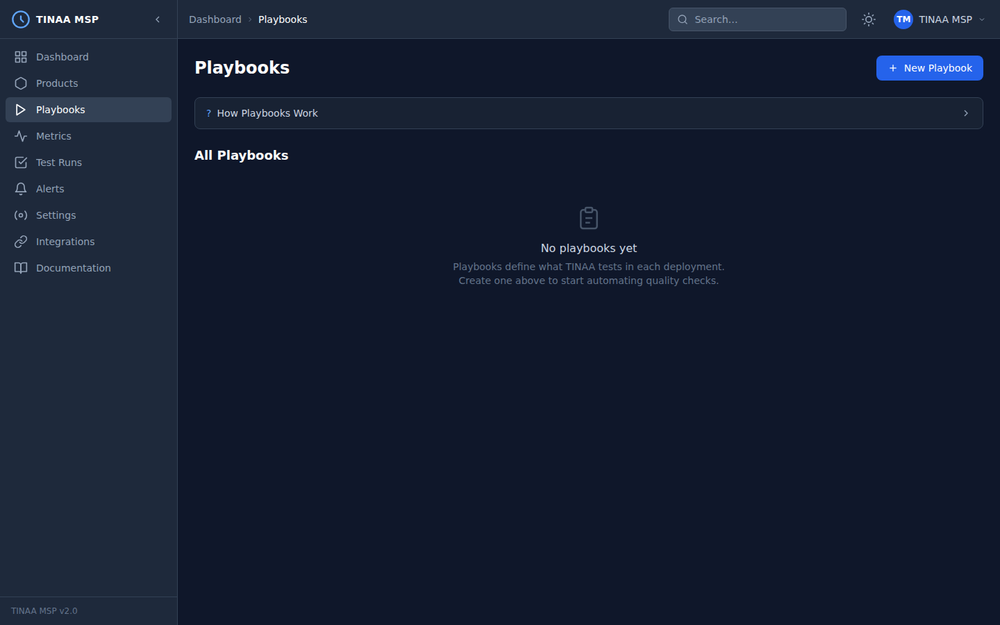

# Test Playbooks

A **playbook** is a declarative, version-controlled test definition that describes a user journey through your application. Playbooks are the fundamental unit of testing in TINAA MSP. They are YAML or JSON files that list the browser actions to perform, the assertions to verify, and the performance thresholds to enforce.



---

## Auto-Generated vs Manual Playbooks

TINAA supports two authoring modes:

| Source | How it works | Best for |
|---|---|---|
| `auto_generated` | TINAA scans your repository and infers journeys from routes, forms, and link structure | Getting coverage quickly on an existing codebase |
| `manual` | You write the YAML by hand or via Claude/MCP | Critical flows requiring precise control |
| `hybrid` | TINAA generates a starter playbook which you then refine | Most teams — generated skeleton, hand-tuned details |

Auto-generation is triggered automatically when you register a product with a `repository_url`. You can also trigger it on demand from the product settings page or via the `explore_codebase` MCP tool.

---

## Playbook Schema

A playbook is defined by the following top-level fields:

```yaml
name: string               # unique name within the product, used as an identifier
description: string        # human-readable description (shown in reports)
priority: critical | high | medium | low
tags:
  - string                 # free-form labels (e.g. "smoke", "checkout", "auth")

# Trigger conditions — when this playbook runs automatically
trigger:
  on_deploy:               # run on deployment to these environments
    - production
    - staging
  on_pr: true              # run as a GitHub Check Run on every PR
  schedule_cron: "0 * * * *"  # also run on a cron schedule (hourly)
  on_change:               # only trigger when these paths change
    - src/checkout/**
    - src/cart/**

# Optional: variables available as ${VAR_NAME} in step params
variables:
  BASE_URL: "https://staging.myapp.com"
  TEST_EMAIL: "qa-robot@example.com"

# Optional: steps that run before the main steps (e.g. login)
setup_steps: []

# The main test steps
steps:
  - action: navigate
    url: "${BASE_URL}"

# Optional: steps that always run after main steps (e.g. logout, cleanup)
teardown_steps: []

# Optional: global assertions checked at end of run
assertions:
  no_console_errors: true
  no_network_failures: true
  max_accessibility_violations: 0

# Optional: performance thresholds that must be met for the run to pass
performance_gates:
  lcp_ms: 2500       # Largest Contentful Paint
  fcp_ms: 1800       # First Contentful Paint
  cls: 0.1           # Cumulative Layout Shift
  inp_ms: 200        # Interaction to Next Paint
  total_duration_ms: 60000  # entire playbook wall-clock time
  max_network_failures: 0
```

---

## Supported Actions

### `navigate`

Navigate the browser to a URL.

```yaml
- action: navigate
  url: "https://staging.myapp.com/checkout"
  # Optional: wait for a specific network idle state before continuing
  wait_until: networkidle  # domcontentloaded | load | networkidle
```

### `click`

Click an element on the page.

```yaml
- action: click
  selector: "button[data-testid='submit-order']"
  # Optional: describe the click for reporting
  description: "Click the Submit Order button"
  # Optional: override the default 30s timeout
  timeout_ms: 10000
```

Selectors follow the [Playwright selector syntax](https://playwright.dev/docs/selectors): CSS selectors, `text=`, `role=`, `data-testid=`, XPath, and more.

### `fill`

Fill a form input with a value.

```yaml
- action: fill
  selector: "input[name='email']"
  value: "${TEST_EMAIL}"

- action: fill
  selector: "input[name='password']"
  value: "SecurePassword123!"
```

Use variables (defined in the `variables` block) to avoid hard-coding credentials in playbook files.

### `type`

Type text character-by-character, simulating keyboard input. Useful when `fill` bypasses input event listeners.

```yaml
- action: type
  selector: "#search-box"
  value: "wireless headphones"
```

### `select`

Select an option in a `<select>` dropdown by value or label.

```yaml
- action: select
  selector: "select[name='country']"
  value: "US"           # select by option value
  # label: "United States"  # or select by visible text
```

### `press_key`

Send a keyboard key press to a focused element or globally.

```yaml
- action: press_key
  key: "Enter"

- action: press_key
  selector: "#promo-code-input"
  key: "Tab"
```

### `screenshot`

Capture a screenshot. Screenshots are embedded in test reports and stored for trend comparison.

```yaml
- action: screenshot
  name: "checkout-confirmation"   # used as the screenshot filename in reports
  full_page: false                # set true to capture the full scrollable page
```

### `wait`

Pause execution for a fixed duration. Use sparingly — prefer `wait_for_navigation` or implicit waits.

```yaml
- action: wait
  ms: 500
```

### `wait_for_navigation`

Wait until navigation completes (page load, redirect, or SPA route change).

```yaml
- action: wait_for_navigation
  wait_until: networkidle
  timeout_ms: 15000
```

### `hover`

Move the mouse cursor over an element (useful for triggering tooltips or dropdown menus).

```yaml
- action: hover
  selector: "nav .products-menu"
```

### `scroll`

Scroll the page to reveal elements or trigger lazy loading.

```yaml
- action: scroll
  selector: ".product-grid"   # scroll element into view
  # x: 0                      # or scroll by pixel delta
  # y: 500
```

### `clear`

Clear the value of a text input.

```yaml
- action: clear
  selector: "input[name='search']"
```

### `upload_file`

Upload a file to a file input element.

```yaml
- action: upload_file
  selector: "input[type='file']"
  file_path: "fixtures/test-document.pdf"
```

### `set_viewport`

Resize the browser viewport. Useful for responsive design testing.

```yaml
- action: set_viewport
  width: 375
  height: 812
  description: "Switch to iPhone 13 viewport"
```

### `evaluate`

Execute arbitrary JavaScript in the browser context and optionally assert the return value.

```yaml
- action: evaluate
  script: "document.querySelector('#cart-count').textContent"
  expected: "3"
```

### `group`

Group related steps together for reporting clarity. Groups appear as collapsible sections in test reports.

```yaml
- action: group
  description: "Complete payment details"
  steps:
    - action: fill
      selector: "input[name='card_number']"
      value: "4111 1111 1111 1111"
    - action: fill
      selector: "input[name='expiry']"
      value: "12/28"
    - action: fill
      selector: "input[name='cvv']"
      value: "123"
```

### Assert Actions

| Action | Verifies |
|---|---|
| `assert_visible` | Element exists and is visible |
| `assert_hidden` | Element does not exist or is hidden |
| `assert_text` | Element contains expected text |
| `assert_url` | Current URL matches pattern |
| `assert_title` | Page `<title>` matches |
| `assert_no_console_errors` | No `console.error()` calls during the step |
| `assert_no_network_failures` | No 4xx/5xx responses since last check |
| `assert_accessibility` | No WCAG violations on the current page state |

```yaml
- action: assert_visible
  selector: ".order-confirmation"
  description: "Order confirmation banner is shown"

- action: assert_text
  selector: "h1.order-title"
  text: "Thank you for your order"

- action: assert_url
  pattern: "/order/[0-9]+"

- action: assert_accessibility
  level: "AA"   # A | AA | AAA
```

---

## Suite Types

Playbooks are tagged with one or more suite types that determine when they run:

| Suite | Purpose | Typical duration |
|---|---|---|
| `smoke` | Fast sanity check — does the app start and respond? | < 2 minutes |
| `regression` | Full user journey coverage before a release | 5–20 minutes |
| `accessibility` | WCAG compliance audit | 3–10 minutes |
| `performance` | Web Vitals, LCP, CLS, response times | 5–15 minutes |
| `security` | Headers, TLS, mixed content, form security | 2–5 minutes |

Tag a playbook with a suite type in the `tags` field:

```yaml
tags:
  - smoke
  - regression
```

---

## Running Playbooks

### From the Dashboard (UI)

1. Navigate to **Playbooks** in the left sidebar
2. Find the playbook you want to run
3. Click the **Run** button (or the three-dot menu for options)
4. Select the target environment
5. Click **Execute**

The run appears in **Test Runs** in real time as steps complete.

### Via the REST API

```bash
POST /api/v1/playbooks/{playbook_id}/run
Content-Type: application/json
X-API-Key: <your-api-key>

{
  "environment": "staging",
  "target_url": "https://staging.myapp.com"  # optional URL override
}
```

### Via MCP (Claude Code)

```
run_playbook(
  playbook_id_or_name="checkout-regression",
  environment="staging"
)
```

Or run the full test suite for a product:

```
run_suite(
  product_id_or_slug="checkout-service",
  environment="staging",
  suite_type="regression"
)
```

### Via CI/CD

Use the TINAA CLI or API in your pipeline. Example for GitHub Actions:

```yaml
- name: Run TINAA smoke tests
  run: |
    curl -X POST $TINAA_URL/api/v1/products/$PRODUCT_SLUG/run-suite \
      -H "X-API-Key: $TINAA_API_KEY" \
      -H "Content-Type: application/json" \
      -d '{"suite_type": "smoke", "environment": "staging"}' \
      --fail-with-body
  env:
    TINAA_URL: ${{ vars.TINAA_URL }}
    TINAA_API_KEY: ${{ secrets.TINAA_API_KEY }}
    PRODUCT_SLUG: checkout-service
```

---

## Performance Gates in Playbooks

Performance gates define thresholds that a test run must meet to be considered passing. If any gate is breached, the run is marked `failed` even if all browser assertions pass.

```yaml
performance_gates:
  lcp_ms: 2500        # Largest Contentful Paint must be <= 2.5 seconds
  fcp_ms: 1800        # First Contentful Paint must be <= 1.8 seconds
  cls: 0.1            # Cumulative Layout Shift score must be <= 0.1
  inp_ms: 200         # Interaction to Next Paint must be <= 200ms
  total_duration_ms: 120000  # Entire playbook must complete within 2 minutes
  max_network_failures: 0    # Zero 4xx/5xx responses allowed
```

When performance gates are defined, TINAA instruments the Playwright browser with the Web Performance APIs to capture metrics throughout the run. Results appear in the test run report alongside the step-level results.

---

## Full Example: E-Commerce Checkout Flow

```yaml
name: checkout-full-flow
description: >
  End-to-end checkout journey: browse products, add to cart, enter
  payment details, and confirm the order.
priority: critical
tags:
  - regression
  - smoke

trigger:
  on_deploy:
    - production
    - staging
  on_pr: true
  on_change:
    - src/checkout/**
    - src/cart/**
    - src/payment/**

variables:
  BASE_URL: "https://staging.myapp.com"
  USER_EMAIL: "qa-robot@example.com"
  USER_PASSWORD: "QaPassword123!"

setup_steps:
  - action: navigate
    url: "${BASE_URL}/login"
  - action: fill
    selector: "input[name='email']"
    value: "${USER_EMAIL}"
  - action: fill
    selector: "input[name='password']"
    value: "${USER_PASSWORD}"
  - action: click
    selector: "button[type='submit']"
    description: "Log in"
  - action: assert_url
    pattern: "/dashboard"
  - action: wait_for_navigation
    wait_until: networkidle

steps:
  - action: navigate
    url: "${BASE_URL}/products"
  - action: screenshot
    name: "product-listing"
  - action: click
    selector: ".product-card:first-child .add-to-cart"
    description: "Add first product to cart"
  - action: assert_visible
    selector: ".cart-notification"
    description: "Cart notification appears"
  - action: navigate
    url: "${BASE_URL}/cart"
  - action: assert_text
    selector: ".cart-item-count"
    text: "1 item"
  - action: click
    selector: "a[href='/checkout']"
    description: "Proceed to checkout"
  - action: wait_for_navigation
    wait_until: networkidle
  - action: screenshot
    name: "checkout-page"

  - action: group
    description: "Fill shipping address"
    steps:
      - action: fill
        selector: "input[name='full_name']"
        value: "QA Robot"
      - action: fill
        selector: "input[name='address_line1']"
        value: "123 Test Street"
      - action: fill
        selector: "input[name='city']"
        value: "San Francisco"
      - action: select
        selector: "select[name='state']"
        value: "CA"
      - action: fill
        selector: "input[name='zip']"
        value: "94102"

  - action: group
    description: "Fill payment details"
    steps:
      - action: fill
        selector: "input[name='card_number']"
        value: "4111 1111 1111 1111"
      - action: fill
        selector: "input[name='expiry']"
        value: "12/28"
      - action: fill
        selector: "input[name='cvv']"
        value: "123"

  - action: screenshot
    name: "checkout-filled"
  - action: click
    selector: "button[data-testid='place-order']"
    description: "Place order"
  - action: wait_for_navigation
    wait_until: networkidle
  - action: assert_url
    pattern: "/order-confirmation/[0-9]+"
  - action: assert_visible
    selector: ".confirmation-banner"
  - action: assert_text
    selector: "h1"
    text: "Thank you for your order"
  - action: screenshot
    name: "order-confirmation"

teardown_steps:
  - action: navigate
    url: "${BASE_URL}/logout"

assertions:
  no_console_errors: true
  no_network_failures: true

performance_gates:
  lcp_ms: 2500
  cls: 0.1
  total_duration_ms: 120000
```

---

## Full Example: Login and Authentication

```yaml
name: login-auth-flows
description: >
  Covers successful login, failed login, session persistence,
  and logout across the authentication system.
priority: critical
tags:
  - smoke
  - regression

trigger:
  on_deploy:
    - production
    - staging
  on_pr: true
  on_change:
    - src/auth/**
    - src/login/**

variables:
  BASE_URL: "https://staging.myapp.com"
  VALID_EMAIL: "qa-robot@example.com"
  VALID_PASSWORD: "QaPassword123!"

steps:
  # ---- Scenario 1: Successful login ----
  - action: navigate
    url: "${BASE_URL}/login"
  - action: assert_title
    title: "Sign In — My App"
  - action: assert_visible
    selector: "input[name='email']"
  - action: fill
    selector: "input[name='email']"
    value: "${VALID_EMAIL}"
  - action: fill
    selector: "input[name='password']"
    value: "${VALID_PASSWORD}"
  - action: screenshot
    name: "login-filled"
  - action: click
    selector: "button[type='submit']"
  - action: wait_for_navigation
    wait_until: networkidle
  - action: assert_url
    pattern: "/dashboard"
  - action: assert_visible
    selector: ".user-menu"
    description: "User menu visible after login"

  # ---- Scenario 2: Invalid credentials ----
  - action: navigate
    url: "${BASE_URL}/logout"
  - action: navigate
    url: "${BASE_URL}/login"
  - action: fill
    selector: "input[name='email']"
    value: "wrong@example.com"
  - action: fill
    selector: "input[name='password']"
    value: "WrongPassword!"
  - action: click
    selector: "button[type='submit']"
  - action: assert_visible
    selector: ".error-message"
    description: "Error message shown for bad credentials"
  - action: assert_text
    selector: ".error-message"
    text: "Invalid email or password"
  - action: assert_url
    pattern: "/login"
    description: "User stays on login page after failed attempt"

  # ---- Scenario 3: Logout ----
  - action: navigate
    url: "${BASE_URL}/login"
  - action: fill
    selector: "input[name='email']"
    value: "${VALID_EMAIL}"
  - action: fill
    selector: "input[name='password']"
    value: "${VALID_PASSWORD}"
  - action: click
    selector: "button[type='submit']"
  - action: wait_for_navigation
    wait_until: networkidle
  - action: click
    selector: ".user-menu"
  - action: click
    selector: "a[href='/logout']"
  - action: wait_for_navigation
    wait_until: networkidle
  - action: assert_url
    pattern: "/login|/"
    description: "User redirected after logout"
  - action: assert_hidden
    selector: ".user-menu"

assertions:
  no_console_errors: true
  max_accessibility_violations: 0

performance_gates:
  lcp_ms: 2000
  total_duration_ms: 60000
```

---

## Next Steps

- [Quality Scores](quality-scores.md) — how playbook results affect the composite score
- [Metrics and APM](metrics.md) — performance data captured during playbook runs
- [Alerts](alerts.md) — set up notifications when playbooks fail
- [MCP Integration](mcp-integration.md) — create and run playbooks from Claude
