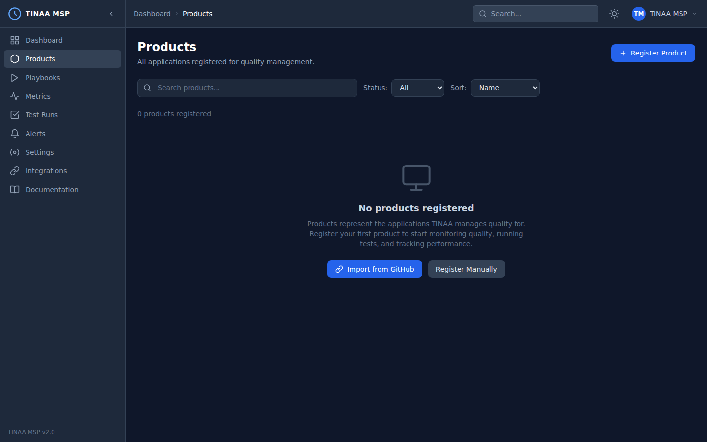

# Products and Environments

A **product** in TINAA MSP is the top-level entity that represents one application — a web app, API service, marketing site, or anything else you want to monitor and test continuously. Everything in TINAA (playbooks, quality scores, alerts, APM metrics) belongs to a product.



---

## What Is a Product?

Products are the unit of ownership in TINAA. When you register a product you tell TINAA:

- What the application is called
- Where to find the source code (repository URL)
- Which environments to monitor (production, staging, preview, etc.)

TINAA uses this information to:

- Run synthetic availability checks against every environment
- Generate baseline performance metrics
- Suggest test playbooks based on codebase analysis
- Report a quality score per environment and aggregated across all environments

---

## Registering a Product

### Via the Dashboard (UI)

1. Navigate to **Settings > Products** in the left sidebar
2. Click **Register Product** (or the **+** button)
3. Fill in the form:
   - **Name** — human-readable name, e.g. `Checkout Service`
   - **Repository URL** — `https://github.com/myorg/checkout-service`
   - **Description** — optional, used in reports and notifications
4. Add at least one environment (see [Adding Environments](#adding-environments))
5. Click **Save Product**

TINAA slugifies the product name automatically (`checkout-service`) and uses the slug in API paths and MCP tool calls.

### Via the REST API

```bash
POST /api/v1/products
Content-Type: application/json
X-API-Key: <your-api-key>

{
  "name": "Checkout Service",
  "repository_url": "https://github.com/myorg/checkout-service",
  "description": "Handles cart, payment, and order confirmation flows",
  "environments": {
    "production": "https://checkout.myapp.com",
    "staging": "https://checkout-staging.myapp.com"
  }
}
```

**Response:**

```json
{
  "id": "3f8a1b2c-...",
  "name": "Checkout Service",
  "slug": "checkout-service",
  "repository_url": "https://github.com/myorg/checkout-service",
  "description": "Handles cart, payment, and order confirmation flows",
  "quality_score": null,
  "status": "active",
  "environments": [],
  "created_at": "2026-03-23T10:00:00Z"
}
```

The `quality_score` is `null` until the first test run or synthetic check completes.

### Via MCP (Claude Code / Claude Desktop)

```
register_product(
  name="Checkout Service",
  repo_url="https://github.com/myorg/checkout-service",
  environments={
    "production": "https://checkout.myapp.com",
    "staging": "https://checkout-staging.myapp.com"
  },
  description="Handles cart, payment, and order confirmation flows"
)
```

See the [MCP Integration guide](mcp-integration.md) for full setup instructions.

---

## Environments

An environment is a named deployment target associated with a product. Each environment has its own base URL, monitoring configuration, and quality scores tracked independently.

### Standard Environment Types

| Type | Typical URL pattern | Monitoring frequency |
|---|---|---|
| `production` | `https://www.myapp.com` | Every 5 minutes |
| `staging` | `https://staging.myapp.com` | Every 15 minutes |
| `preview` | `https://pr-123.preview.myapp.com` | On demand / per deployment |
| `development` | `http://localhost:3000` | Manual only |

### Adding Environments via the Dashboard

1. Open the product detail page
2. Click the **Environments** tab
3. Click **Add Environment**
4. Fill in:
   - **Name** — e.g. `staging`
   - **Base URL** — full URL including scheme, e.g. `https://staging.myapp.com`
   - **Type** — select from `production`, `staging`, `preview`
   - **Monitoring interval** — how often TINAA runs synthetic checks (default: 300 seconds)
5. Click **Save**

### Adding Environments via the REST API

```bash
POST /api/v1/products/{product_id}/environments
Content-Type: application/json
X-API-Key: <your-api-key>

{
  "name": "staging",
  "base_url": "https://staging.myapp.com",
  "env_type": "staging",
  "monitoring_interval_seconds": 300
}
```

---

## Endpoints Within Environments

Endpoints are the individual URLs and API routes that TINAA monitors and tests within an environment. Endpoints are auto-discovered from your repository via codebase exploration, or can be registered manually.

### Registering Endpoints Manually

```bash
POST /api/v1/products/{product_id}/environments/{environment_id}/endpoints
Content-Type: application/json
X-API-Key: <your-api-key>

{
  "path": "/checkout",
  "method": "GET",
  "endpoint_type": "page",
  "performance_budget_ms": 2000,
  "expected_status_code": 200
}
```

### Endpoint Types

| Type | Description | Monitored for |
|---|---|---|
| `page` | Full HTML page | Web Vitals, accessibility, response time |
| `api` | JSON API endpoint | Response time, status codes, error rate |
| `asset` | Static asset (JS, CSS, images) | Response time, cache headers |

### Auto-Discovery via Codebase Exploration

When you provide a `repository_url` during product registration, TINAA scans the codebase to discover:

- Express/FastAPI/Django/Rails routes
- HTML anchor `href` values
- API endpoint definitions

Trigger codebase exploration manually from the product settings page or via MCP:

```
explore_codebase(product_id_or_slug="checkout-service")
```

---

## Auto-Discovery of Preview URLs

TINAA watches GitHub Deployment events to automatically create preview environments for pull requests deployed to services like Vercel, Netlify, and Render.

When GitHub sends a `deployment_status` webhook with `state: success`, TINAA:

1. Extracts the deployment URL from the webhook payload
2. Creates a temporary `preview` environment scoped to the PR
3. Runs the product's smoke test suite against the preview URL
4. Posts the results as a GitHub Check Run on the PR

Preview environments are automatically archived when the PR is merged or closed.

**Requirements:**

- GitHub integration configured (see [GitHub Integration](integrations.md))
- Deployment events enabled in your deployment platform's GitHub integration
- TINAA webhook URL registered in your GitHub App or repository settings

---

## Product Status

Each product has a `status` field that controls whether TINAA actively monitors it.

| Status | Description | Effect |
|---|---|---|
| `active` | Normal operation | Synthetic checks run, alerts fire, quality scores update |
| `paused` | Temporarily suspended | No synthetic checks, no alerts, last score preserved |
| `archived` | Permanently retired | Hidden from dashboard, data retained for 90 days |

### Changing Status

Via the dashboard: open the product detail page and use the **Status** dropdown in the header.

Via the API:

```bash
PATCH /api/v1/products/{product_id}
Content-Type: application/json
X-API-Key: <your-api-key>

{
  "status": "paused"
}
```

---

## Listing and Filtering Products

```bash
# List all active products
GET /api/v1/products?status=active

# List all products (all statuses)
GET /api/v1/products

# Get a single product by slug
GET /api/v1/products/checkout-service
```

**Example response:**

```json
{
  "products": [
    {
      "id": "3f8a1b2c-...",
      "name": "Checkout Service",
      "slug": "checkout-service",
      "quality_score": 87.4,
      "status": "active",
      "environment_count": 2,
      "last_run_at": "2026-03-23T09:45:00Z"
    }
  ],
  "total": 1
}
```

---

## Next Steps

- [Test Playbooks](playbooks.md) — define and run automated tests against your products
- [Quality Scores](quality-scores.md) — understand how the score is computed per product
- [Alerts](alerts.md) — get notified when quality drops or endpoints go down
- [GitHub Integration](integrations.md) — link deployments and PRs to quality gate results
