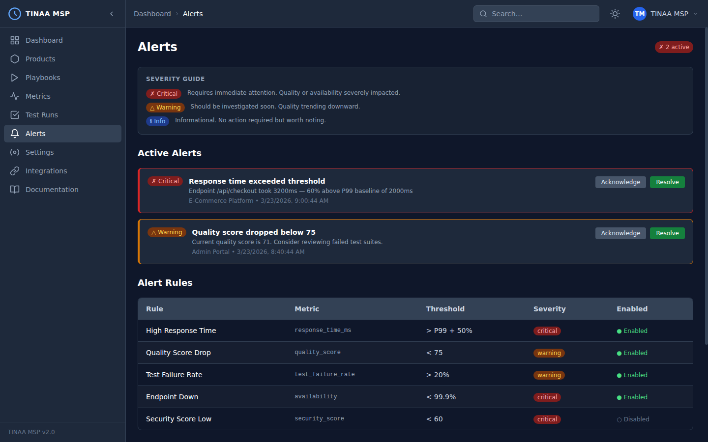
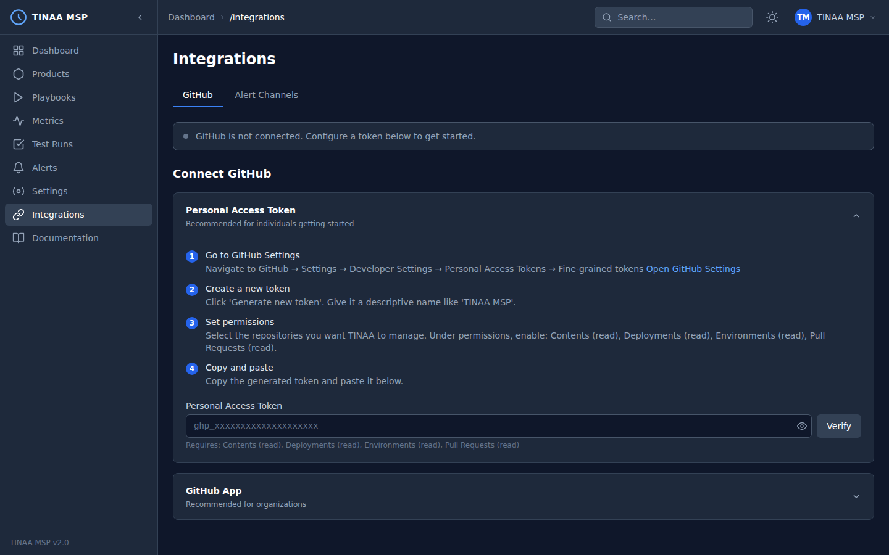

<!-- ═══════════════════════════════════════════════════════════ -->
<!-- HERO                                                         -->
<!-- ═══════════════════════════════════════════════════════════ -->
<section class="hero">
  
Managed Service Platform &nbsp;·&nbsp; v2.0

  <h1 class="hero-title">
    Continuous Quality, Automated.
  </h1>
  

    TINAA MSP is an autonomous quality platform that generates Playwright tests,
    monitors performance, computes a composite Quality Score, and gates deploys —
    all from a single AI-coordinated system.
  

  

    <a href="guide/getting-started" class="btn btn-primary">
      <svg width="16" height="16" fill="none" stroke="currentColor" stroke-width="2" stroke-linecap="round" stroke-linejoin="round" viewBox="0 0 24 24"><polygon points="5 3 19 12 5 21 5 3"/></svg>
      Get Started
    </a>
    <a href="https://github.com/aj-geddes/tinaa-playwright-msp" class="btn btn-secondary">
      <svg width="16" height="16" viewBox="0 0 24 24" fill="currentColor"><path d="M12 2C6.477 2 2 6.484 2 12.017c0 4.425 2.865 8.18 6.839 9.504.5.092.682-.217.682-.483 0-.237-.008-.868-.013-1.703-2.782.605-3.369-1.343-3.369-1.343-.454-1.158-1.11-1.466-1.11-1.466-.908-.62.069-.608.069-.608 1.003.07 1.531 1.032 1.531 1.032.892 1.53 2.341 1.088 2.91.832.092-.647.35-1.088.636-1.338-2.22-.253-4.555-1.113-4.555-4.951 0-1.093.39-1.988 1.029-2.688-.103-.253-.446-1.272.098-2.65 0 0 .84-.27 2.75 1.026A9.564 9.564 0 0112 6.844c.85.004 1.705.115 2.504.337 1.909-1.296 2.747-1.027 2.747-1.027.546 1.379.202 2.398.1 2.651.64.7 1.028 1.595 1.028 2.688 0 3.848-2.339 4.695-4.566 4.943.359.309.678.92.678 1.855 0 1.338-.012 2.419-.012 2.747 0 .268.18.58.688.482A10.019 10.019 0 0022 12.017C22 6.484 17.522 2 12 2z"/></svg>
      View on GitHub
    </a>
  

  

    
  

</section>

<!-- ═══════════════════════════════════════════════════════════ -->
<!-- STATS BAR                                                    -->
<!-- ═══════════════════════════════════════════════════════════ -->

  

    

      1,400+
      Tests generated
    

    

    

      6
      AI agents
    

    

    

      14
      MCP tools
    

    

    

      0–100
      Quality score
    

    

    

      5
      Web vitals tracked
    

  

<!-- ═══════════════════════════════════════════════════════════ -->
<!-- WHAT IS TINAA                                                -->
<!-- ═══════════════════════════════════════════════════════════ -->

<section class="what-is">
  

    

      

        
What is TINAA MSP?

        <h2 class="section-heading">Not just testing. Not just APM. Both — fully autonomous.</h2>
        

          Traditional testing tools require you to write and maintain tests manually.
          Traditional APM tools alert you after something breaks. TINAA MSP does both
          proactively: it reads your codebase, generates Playwright test playbooks
          automatically, monitors your live endpoints in real time, and computes a
          single Quality Score that tells you — and your CI pipeline — whether a
          deployment is safe.
        

        

          Six specialised AI agents work under a central Orchestrator so that every
          product registered in TINAA is permanently under supervised quality watch.
        

      

      

        <table class="compare-table">
          <thead>
            <tr>
              <th>Capability</th>
              <th>TINAA MSP</th>
              <th>Traditional tools</th>
            </tr>
          </thead>
          <tbody>
            <tr>
              <td>Auto-generate tests from code</td>
              <td class="check">&#10003;</td>
              <td class="cross">&#10007;</td>
            </tr>
            <tr>
              <td>Composite Quality Score</td>
              <td class="check">&#10003;</td>
              <td class="cross">&#10007;</td>
            </tr>
            <tr>
              <td>Synthetic monitoring + Web Vitals</td>
              <td class="check">&#10003;</td>
              <td class="cross">partial</td>
            </tr>
            <tr>
              <td>Block deploys on quality failure</td>
              <td class="check">&#10003;</td>
              <td class="cross">&#10007;</td>
            </tr>
            <tr>
              <td>GitHub Check Runs on PRs</td>
              <td class="check">&#10003;</td>
              <td class="cross">&#10007;</td>
            </tr>
            <tr>
              <td>Claude Code / MCP integration</td>
              <td class="check">&#10003;</td>
              <td class="cross">&#10007;</td>
            </tr>
          </tbody>
        </table>
      

    

  

</section>

<!-- ═══════════════════════════════════════════════════════════ -->
<!-- FEATURES GRID                                                -->
<!-- ═══════════════════════════════════════════════════════════ -->

<section class="features-bg">
  

    
Platform features

    <h2 class="section-heading">Everything quality requires, built in.</h2>
    
Six focused capabilities that work together so you ship with confidence.

    

      <!-- Autonomous Testing -->
      

        

          <svg viewBox="0 0 24 24"><path d="M12 2L2 7l10 5 10-5-10-5z"/><path d="M2 17l10 5 10-5"/><path d="M2 12l10 5 10-5"/></svg>
        

        
Autonomous Testing

        

          The Explorer and Test Designer agents analyse your repository structure and
          running application to auto-generate comprehensive Playwright playbooks.
          No manual test authoring required.
        

      

      <!-- Quality Scoring -->
      

        

          <svg viewBox="0 0 24 24"><circle cx="12" cy="12" r="10"/><path d="M12 6v6l4 2"/></svg>
        

        
Quality Scoring

        

          A composite 0–100 Quality Score weighs test health (40 %), performance
          (30 %), security (15 %), and accessibility (15 %) into one actionable
          number tracked over time.
        

      

      <!-- APM & Web Vitals -->
      

        

          <svg viewBox="0 0 24 24"><polyline points="22 12 18 12 15 21 9 3 6 12 2 12"/></svg>
        

        
APM &amp; Web Vitals

        

          Continuous synthetic monitoring tracks LCP, FCP, CLS, INP, and TTFB
          against configurable thresholds. The APM agent correlates performance
          regressions directly to deployments.
        

      

      <!-- Deployment Gates -->
      

        

          <svg viewBox="0 0 24 24"><rect x="3" y="11" width="18" height="11" rx="2" ry="2"/><path d="M7 11V7a5 5 0 0 1 10 0v4"/></svg>
        

        
Deployment Gates

        

          Define minimum Quality Score thresholds per environment. TINAA posts a
          GitHub Check Run on every PR — green to merge, red to block — keeping bad
          code out of production automatically.
        

      

      <!-- GitHub Integration -->
      

        

          <svg viewBox="0 0 24 24"><circle cx="18" cy="18" r="3"/><circle cx="6" cy="6" r="3"/><path d="M6 21V9a9 9 0 0 0 9 9"/></svg>
        

        
GitHub Integration

        

          Deep GitHub App integration: Check Runs on pull requests, deployment
          environment tracking, automatic issue creation on quality regressions, and
          webhook-driven test triggers on push.
        

      

      <!-- MCP / Claude Code -->
      

        

          <svg viewBox="0 0 24 24"><rect x="2" y="3" width="20" height="14" rx="2" ry="2"/><line x1="8" y1="21" x2="16" y2="21"/><line x1="12" y1="17" x2="12" y2="21"/></svg>
        

        
Claude Code / MCP

        

          A full MCP server exposes 14 tools so Claude Code can register products,
          trigger test runs, query Quality Scores, and manage alerts — all from your
          terminal without leaving your editor.
        

      

    

  

</section>

<!-- ═══════════════════════════════════════════════════════════ -->
<!-- SCREENSHOT GALLERY                                           -->
<!-- ═══════════════════════════════════════════════════════════ -->

<section class="gallery-bg">
  

    
Platform screenshots

    <h2 class="section-heading">See it in action.</h2>
    
A dark-first web dashboard built with Web Components and Tailwind CSS, deployed at <a href="https://tinaa.hvs">tinaa.hvs</a>.

    

      

        
        

          <strong>Dashboard</strong>
          Quality Score gauge, live agent status, and recent test-run history at a glance.
        

      

      

        
        

          <strong>Alerts</strong>
          Multi-channel alert rules with severity classification — Slack, Teams, PagerDuty, and more.
        

      

      

        
        

          <strong>Metrics &amp; Web Vitals</strong>
          Time-series charts for LCP, FCP, CLS, INP, and TTFB with configurable time ranges.
        

      

      

        
        

          <strong>GitHub Integration</strong>
          Connect a GitHub App in minutes — Check Runs, deployment tracking, and issue creation included.
        

      

    

  

</section>

<!-- ═══════════════════════════════════════════════════════════ -->
<!-- HOW IT WORKS                                                 -->
<!-- ═══════════════════════════════════════════════════════════ -->

<section class="how-bg">
  

    
How it works

    <h2 class="section-heading">Three steps to autonomous quality.</h2>
    
From first registration to gated deploys in under an hour.

    

      

        
1

        
Register a product

        

          Point TINAA at your repository and deployed environments.
          Provide a base URL and optional credentials. That is all the
          configuration required to start.
        

      

      
&#8594;

      

        
2

        
TINAA explores

        

          The Explorer agent crawls your live application and analyses your
          codebase. The Test Designer generates a prioritised Playwright
          playbook. The APM agent begins endpoint monitoring.
        

      

      
&#8594;

      

        
3

        
Continuous quality

        

          The Test Runner executes playbooks on every deploy. The Analyst
          computes the Quality Score. The Reporter gates your GitHub Check
          Run and sends alerts when thresholds are breached.
        

      

    

  

</section>

<!-- ═══════════════════════════════════════════════════════════ -->
<!-- ARCHITECTURE                                                 -->
<!-- ═══════════════════════════════════════════════════════════ -->

<section class="arch-bg">
  

    
Architecture

    <h2 class="section-heading">Agent-based, event-driven.</h2>
    
An Orchestrator coordinates six specialised agents over an async message bus.

    

      

        

          

            
Orchestrator

            
Coordinates all agents, manages state &amp; scheduling

          

          

            
Explorer

            
Crawls app, maps routes

          

          

            
Test Designer

            
Generates Playwright playbooks

          

          

            
Test Runner

            
Executes tests, reports results

          

          

            
APM

            
Synthetic monitoring + Web Vitals

          

          

            
Analyst

            
Computes Quality Score

          

          

            
Reporter

            
Alerts, GitHub Checks, issues

          

        

      

      

        <ul class="arch-stack">
          <li>API layer FastAPI, async Python 3.11+</li>
          <li>Test engine Playwright (Chromium, Firefox, WebKit)</li>
          <li>Primary store PostgreSQL + TimescaleDB (time-series metrics)</li>
          <li>Cache / pub-sub Redis</li>
          <li>Dashboard Web Components, Tailwind CSS, dark mode</li>
          <li>MCP server FastMCP — 14 tools for Claude Code</li>
          <li>Deployment Docker Compose or Kubernetes (Helm chart)</li>
          <li>Alerts Slack, Teams, Email, PagerDuty, Webhooks, GitHub Issues</li>
        </ul>
      

    

  

</section>

<!-- ═══════════════════════════════════════════════════════════ -->
<!-- QUICK START                                                  -->
<!-- ═══════════════════════════════════════════════════════════ -->

<section class="quickstart-bg">
  

    
Quick start

    <h2 class="section-heading">Up and running in minutes.</h2>
    
Docker Compose is the fastest path to a working TINAA MSP instance.

    

      

        
&nbsp;&nbsp;&nbsp;&nbsp;&nbsp;&nbsp;&nbsp;&nbsp;&nbsp;&nbsp;&nbsp;&nbsp;bash

        <pre># 1 — Clone the repository
git clone https://github.com/aj-geddes/tinaa-playwright-msp.git
cd tinaa-playwright-msp

# 2 — Copy and edit environment variables
cp .env.example .env
#   Set GITHUB_TOKEN, DB credentials, etc.

# 3 — Start all services
docker compose up -d

# 4 — Confirm the API is ready
curl http://localhost:8000/health

# 5 — Open the dashboard
#   http://localhost:8000</pre>
      

      <ol class="qs-steps">
        <li>
          

            <strong>Clone &amp; configure</strong>
            Copy <code>.env.example</code> to <code>.env</code> and fill in your
            database credentials and GitHub token.
          

        </li>
        <li>
          

            <strong>Start services</strong>
            <code>docker compose up -d</code> brings up the API, PostgreSQL,
            TimescaleDB, and Redis in one command.
          

        </li>
        <li>
          

            <strong>Register your first product</strong>
            POST to <code>/api/v1/products</code> with your repo URL and base
            application URL, or use the dashboard form.
          

        </li>
        <li>
          

            <strong>Connect GitHub</strong>
            Install the GitHub App and configure the webhook. TINAA will post
            Check Runs on your next pull request automatically.
          

        </li>
        <li>
          

            <strong>Connect Claude Code (optional)</strong>
            Add TINAA's MCP server to your Claude Code config for 14 AI-powered
            quality tools directly in your terminal.
          

        </li>
      </ol>
    

  

</section>

<!-- ═══════════════════════════════════════════════════════════ -->
<!-- CTA                                                          -->
<!-- ═══════════════════════════════════════════════════════════ -->
<section class="cta-bg">
  

    <h2 class="cta-title">Ready to automate quality?</h2>
    

      Start with the getting-started guide or explore the full documentation to
      see how TINAA MSP fits into your delivery pipeline.
    

    

      <a href="guide/getting-started" class="btn btn-primary">
        Read the guide
      </a>
      <a href="https://github.com/aj-geddes/tinaa-playwright-msp" class="btn btn-secondary">
        <svg width="16" height="16" viewBox="0 0 24 24" fill="currentColor"><path d="M12 2C6.477 2 2 6.484 2 12.017c0 4.425 2.865 8.18 6.839 9.504.5.092.682-.217.682-.483 0-.237-.008-.868-.013-1.703-2.782.605-3.369-1.343-3.369-1.343-.454-1.158-1.11-1.466-1.11-1.466-.908-.62.069-.608.069-.608 1.003.07 1.531 1.032 1.531 1.032.892 1.53 2.341 1.088 2.91.832.092-.647.35-1.088.636-1.338-2.22-.253-4.555-1.113-4.555-4.951 0-1.093.39-1.988 1.029-2.688-.103-.253-.446-1.272.098-2.65 0 0 .84-.27 2.75 1.026A9.564 9.564 0 0112 6.844c.85.004 1.705.115 2.504.337 1.909-1.296 2.747-1.027 2.747-1.027.546 1.379.202 2.398.1 2.651.64.7 1.028 1.595 1.028 2.688 0 3.848-2.339 4.695-4.566 4.943.359.309.678.92.678 1.855 0 1.338-.012 2.419-.012 2.747 0 .268.18.58.688.482A10.019 10.019 0 0022 12.017C22 6.484 17.522 2 12 2z"/></svg>
        View on GitHub
      </a>
    

  

</section>

<!-- ═══════════════════════════════════════════════════════════ -->
<!-- FOOTER                                                       -->
<!-- ═══════════════════════════════════════════════════════════ -->
<footer class="site-footer">
  

    TINAA MSP &mdash; Testing Intelligence Network Automation Assistant &mdash; Managed Service Platform
    &nbsp;&nbsp;|&nbsp;&nbsp;
    <a href="https://github.com/aj-geddes/tinaa-playwright-msp">GitHub</a>
    &nbsp;&middot;&nbsp;
    <a href="guide/getting-started">Getting Started</a>
    &nbsp;&middot;&nbsp;
    <a href="https://github.com/aj-geddes/tinaa-playwright-msp/blob/main/LICENSE">License</a>
  

</footer>
